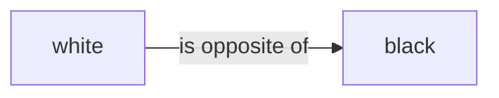
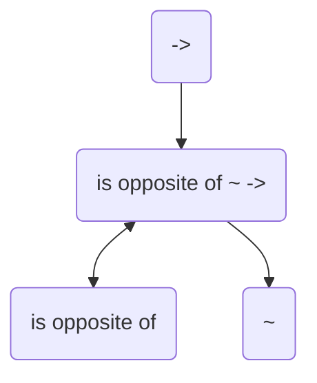
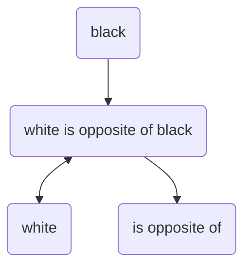
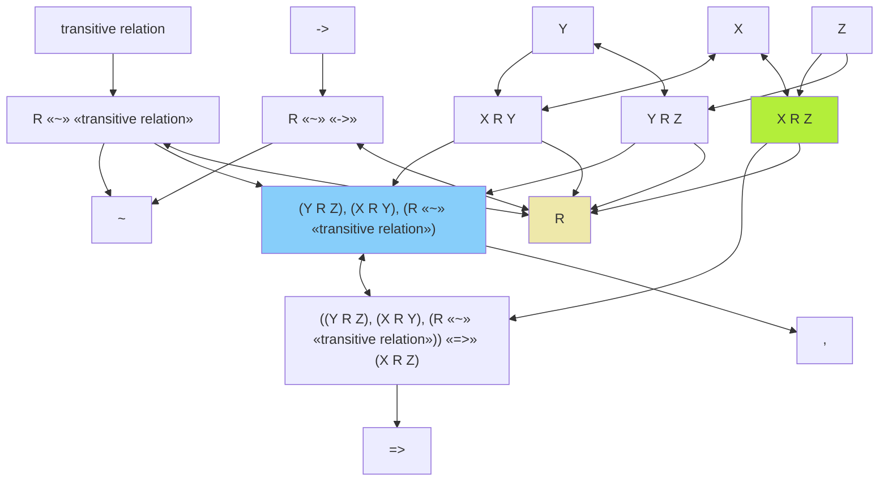

# zelph: A Sophisticated Semantic Network System

## Quick Start Guide

### Installation

Choose the method that matches your operating system:

#### 🐧 Linux (Arch Linux)

zelph is available in the [AUR](https://aur.archlinux.org/packages/zelph):

```bash
pikaur -S zelph
```

#### 🐧 Linux (Other Distributions)

Download the latest `zelph-linux.zip` from [Releases](https://github.com/acrion/zelph/releases), extract it, and run the binary directly.
Alternatively, see [Building zelph](#building-zelph) below to compile from source.

#### 🍏 macOS (via Homebrew)

```bash
brew tap acrion/zelph
brew install zelph
```

#### 🪟 Windows (via Chocolatey)

```powershell
choco install zelph
```

*(Note: During the initial review period, the additional argument `--version 0.9.2` is required. Once approved, `choco install zelph` will suffice.)*

### Basic Usage

Once installed, you can run zelph in interactive mode simply by typing `zelph` in your terminal.
(If you downloaded a binary manually without installing, run `./zelph` from the extraction directory).

Let’s try a basic example:

```
Berlin "is capital of" Germany
Germany "is located in" Europe
X is capital of Y, Y is located in Z => X is located in Z
```

After entering these statements, zelph will automatically infer that Berlin is located in Europe:

```
«Berlin» «is located in» «Europe» ⇐ («Germany» «is located in» «Europe»), («Berlin» «is capital of» «Germany»)
```

Note that none of the items used in the above statements are predefined, i.e. all are made known to zelph by these statements.
In section [Semantic Network Structure](#semantic-network-structure) you’ll find details about the core concepts, including syntactic details.

### Using Sample Scripts

zelph comes with sample scripts to demonstrate its capabilities:

```bash
# Run with the English examples script
./build/bin/zelph sample_scripts/english.zph

# Or try the Wikidata integration script
./build/bin/zelph sample_scripts/wikidata.zph
```

Within interactive mode, you can load a `.zph` script file using:

```
.import sample_scripts/english.zph
```

### Loading and Saving Network State

zelph allows you to save the current network state to a binary file and load it later:

```
.save network.bin          # Save the current network
.load network.bin          # Load a previously saved network
```

The `.load` command is general-purpose:

- If the file ends with `.bin`, it loads the serialized network directly (fast).
- If the file ends with `.json` (a Wikidata dump), it imports the data and automatically creates a `.bin` cache file for future loads.

### Data Cleanup Commands

zelph provides powerful commands for targeted data removal:

- `.prune-facts <pattern>` – Removes only the matching facts (statement nodes).  
  Useful for deleting specific properties without affecting the entities themselves.

- `.prune-nodes <pattern>` – Removes matching facts **and** all nodes bound to the single variable.  
  Requirements: exactly one variable (subject or single object), fixed relation.  
  **Warning**: This completely deletes the nodes and **all** their connections – use with caution!

- `.cleanup` – Removes all isolated nodes and cleans name mappings.

Example:

```
.lang wikidata
A P31 Q8054                 # Query all proteins
.prune-facts A P31 Q8054    # Remove only "instance of protein" statements
.prune-nodes A P31 Q8054    # Remove statements AND all protein nodes (with all their properties!)
.cleanup                    # Clean up any remaining isolated nodes
```

### Full Command Reference

Type `.help` inside the interactive session for a complete overview, or `.help <command>` for details on a specific command.

Key commands include:

- `.help [command]`          – Show help
- `.exit`                    – Exit interactive mode
- `.lang [code]`             – Show or set current language (e.g., `en`, `de`, `wikidata`)
- `.name <node|id> <new_name>` – Set node name in current language
- `.name <node|id> <lang> <new_name>` – Set node name in specific language
- `.delname <node|id> [lang]` – Delete node name in current (or specified) language
- `.node <name|id>`          – Show detailed node information (names, connections, representation, Wikidata URL)
- `.list <count>`            – List first N existing nodes (internal order, with details)
- `.clist <count>`           – List first N nodes named in current language (sorted by ID if feasible)
- `.out <name|id> [count]`   – List outgoing connected nodes (default 20)
- `.in <name|id> [count]`    – List incoming connected nodes (default 20)
- `.mermaid <name> [depth]`  – Generate Mermaid HTML file for a node (default depth 3)
- `.run`                     – Full inference
- `.run-once`                – Single inference pass
- `.run-md <subdir>`         – Inference + Markdown export
- `.run-file <file>`         – Inference + write deduced facts to file (compressed if wikidata)
- `.decode <file>`           – Decode a file produced by `.run-file`
- `.list-rules`              – List all defined rules
- `.list-predicate-usage [max]` – Show predicate usage statistics (top N most frequent)
- `.list-predicate-value-usage <pred> [max]` – Show object/value usage statistics (top N most frequent values)
- `.remove-rules`            – Remove all inference rules
- `.remove <name|id>`        – Remove a node (destructive: disconnects all edges and cleans names)
- `.import <file.zph>`       – Load and execute a zelph script
- `.load <file>`             – Load saved network (.bin) or import Wikidata JSON (creates .bin cache)
- `.save <file.bin>`         – Save current network to binary file
- `.prune-facts <pattern>`   – Remove all facts matching the query pattern (only statements)
- `.prune-nodes <pattern>`   – Remove matching facts AND all involved subject/object nodes
- `.cleanup`                 – Remove isolated nodes
- `.stat`                    – Show network statistics (nodes, RAM usage, name entries, languages, rules)
- `.wikidata-constraints <json> <dir>` – Export property constraints as zelph scripts

### What’s Next?

- Explore the [Core Concepts](#core-concepts) to understand how zelph represents knowledge
- Learn about [Rules and Inference](#rules-and-inference) to leverage zelph’s reasoning capabilities
- Check out the [Example Script](#example-script) for a comprehensive demonstration

## Introduction

zelph is an innovative semantic network system that allows inference rules to be defined within the network itself.
This project provides a powerful foundation for knowledge representation and automated reasoning, with a special focus on efficiency and logical inference capabilities.
With dedicated import functions and specialized semantic scripts (like [wikidata.zph](https://github.com/acrion/zelph/blob/main/sample_scripts/wikidata.zph)),
zelph offers powerful analysis capabilities for the complete Wikidata knowledge graph while remaining adaptable for any semantic domain.

### Community and Support

Development of zelph is supported by the [Wikimedia Community Fund](https://meta.wikimedia.org/wiki/Grants:Programs/Wikimedia_Community_Fund/Rapid_Fund/zelph:Wikidata_Contradiction_Detection_and_Constraint_Integration_(ID:_23553409)).

The project addresses real-world challenges in large-scale ontology management through direct collaboration with the [Wikidata Ontology Cleaning Task Force](https://www.wikidata.org/wiki/Wikidata:WikiProject_Ontology/Cleaning_Task_Force) and the [Mereology Task Force](https://www.wikidata.org/wiki/Wikidata_talk:WikiProject_Ontology/Mereology_Task_Force).

### Components

The zelph ecosystem includes:

- A core C++ library providing both C++ and C interfaces
- A single command-line binary that offers both interactive usage (CLI) and batch processing capabilities
- API functions beyond what’s available in the command-line interface
- Integration options for languages like Go and Lua through the C interface

The key features of zelph include:

- Representation of knowledge in a semantic network structure
- Rules encoded within the same semantic network as facts
- Support for multi-language node naming
- Contradiction detection and resolution
- Memory-efficient data structures optimized at bit level
- A flexible scripting language for knowledge definition and querying
- Built-in import functionality for Wikidata JSON datasets and general binary save/load

## Core Concepts

### Semantic Network Structure

In zelph, knowledge is represented as a network of nodes connected by relations.
Unlike traditional semantic networks where relations are labeled edges,
zelph treats relation types as first-class nodes themselves.
This unique approach enables powerful meta-reasoning about relations.

### Facts and Relations

Facts in zelph are represented as triples consisting of a subject, relation type, and object.
The standard relation type is `~`, which represents a categorical relation (similar to "is a" or "instance of").
For example:

```
X ~ Y
```

This means "X is an instance of category Y" or "X is a Y".

#### Working with Custom Relations

zelph can work with any type of relation, not just the standard `~` relation.
Here’s how custom relations work:

```
is opposite of ~ ->
> «is opposite of» «~» «->»
white is opposite of black
> «white» «is opposite of» «black»
```

In this example, using the interactive CLI, the first line declares "is opposite of" as a relation type (a member of the `->` category).
After the `>` symbol, we see zelph’s responses.

zelph creates new relation types automatically as needed. The explicit declaration of "is opposite of" can actually be omitted:

```
white "is opposite of" black
> «white» «is opposite of» «black»
```

Here, zelph automatically recognizes that "is opposite of" must be a relation type.
Note that when a relation contains spaces and is being used for the first time, it must be enclosed in quotation marks.
Once the relation is known to zelph, the quotation marks are no longer necessary in subsequent usage.

### Internal Representation of facts

In a conventional semantic network, relations between nodes are labeled, e.g.



zelph’s representation of relation types works fundamentally differently.
As mentioned in the introduction, one of zelph’s distinguishing features is that it treats relation types as first-class nodes rather than as mere edge labels.

At the network level, there is only a single primitive relation type: `~`, which represents a general category relation.
Far from being a limitation, this is actually one of zelph’s most powerful characteristics.
Relations that differ from the basic `~` type are not represented as arrow labels in zelph, but as regular nodes with the same status as any other node in the network.

Internally, zelph creates special nodes to represent relations. For example, when defining:

```
"is opposite of" ~ ->
```

This tells zelph that "is opposite of" is a relation (represented by `->`, which is the category of all relations).
zelph creates a special node to represent this fact.

This can be visualized as follows:



The nodes `->` and `~` are predefined zelph nodes. `->` represents the category of all relations, while `~` represents a subset of this category, namely the category of categorical relations. Every relation that differs from the standard relation `~` (like "is opposite of") is linked to `->` via a `~` relation.

The node `is opposite of ~ ->` represents this specific relation (hence its name).
The relations to other nodes encode its meaning.

This approach provides several advantages:

1. It enables meta-reasoning about relations themselves
2. It simplifies the underlying data structures
3. It allows relations to participate in other relations (higher-order relations)
4. It provides a unified representation mechanism for both facts and rules

This architecture is particularly valuable when working with knowledge bases like Wikidata, where relations (called "properties" in Wikidata terminology) are themselves first-class entities with their own attributes, constraints, and relationships to other entities. zelph’s approach naturally aligns with Wikidata’s conceptual model, allowing for seamless representation and inference across the entire knowledge graph.

Similarly, when stating:

```
white "is opposite of" black
```

zelph creates a special relation node that connects the subject "white" bidirectionally, the object "black" in reverse direction, and the relation type "is opposite of" in the forward direction.



The directions of the relations are as follows:

| Element       | Example        | Relation Direction |
|---------------|----------------|--------------------|
| Subject       | white          | bidirectional      |
| Object        | black          | backward           |
| Relation Type | is opposite of | forward            |

This semantics is used by zelph in several contexts, such as rule unification. It’s required because zelph doesn’t encode relation types as labels on arrows but rather as equal nodes. This has the advantage of facilitating statements about statements, for example, the statement that a relation is transitive.

This design prevents subject and object from being identical in a relation. There are examples of this in Wikidata, e.g., "South Africa (Q258)" "country (P17)" "South Africa (Q258)". "South Africa" is thus linked to itself in Wikidata via the relation (property) "Country". These examples are extremely rare in Wikidata and are ignored during import, with a warning.

## Creating a node graph

You can generate a node graph yourself using zelph’s `.mermaid` command, which outputs a Mermaid HTML format file. For example:

```
.mermaid name 3
```

In this example, `name` refers to the node identifier (in the currently active language specified via the `.lang` command) whose connections you want to visualise. The following number represents the depth of connections to include in the graph (default is 3).

To view the Mermaid graph, open the generated HTML file in a web browser.

## Rules and Inference

One of zelph’s most powerful features is the ability to define inference rules within the same network as facts. Rules are statements containing `=>` with conditions before it and a consequence after it.

Example rule:

```
R ~ "transitive relation", X R Y, Y R Z => X R Z
```

This rule states that if R is a transitive relation, and X is related to Y by R, and Y is related to Z by R, then X is also related to Z by R.
Variables in the zelph syntax are currently single uppercase letters. This restricts the number of variables in a rule to 26.
Note that the scope of variables always is a single rule. Internally, more complex rules are possible, but this is currently
only supported via zelph’s API, not via the scripting interface. See [main.cpp](https://github.com/acrion/zelph/blob/main/src/app/main.cpp)
for an example on how to use the API.

Here is a practical example of how this rule works in zelph (which you can also try out in interactive mode):

```
R ~ transitive relation, X R Y, Y R Z => X R Z
> ((Y R Z), (X R Y), (R «~» «transitive relation»)) «=>» (X R Z)
```

After the `>` symbol, we see zelph’s output, which in this case simply confirms the input of the rule.
The brackets `()` indicate that their content is represented as a separate node - each condition is a separate node in the semantic network.

Now, let’s declare that the relation `>` (greater than) belongs to the category (`~`) of transitive relations:

```
> ~ transitive relation
> «>» «~» «transitive relation»
```

Next, we provide three elements ("4", "5" and "6") for which the `>` relation applies:

```
6 > 5
> «6» «>» «5»
5 > 4
> «5» «>» «4»
«6» «>» «4» ⇐ («5» «>» «4»), («6» «>» «5»), («>» «~» «transitive relation»)
```

After entering `5 > 4`, zelph’s unification mechanism takes effect and automatically adds a new fact: `6 > 4`. This demonstrates the power of the transitive relation rule in action.

Rules can also define contradictions using `!`:

```
X "is opposite of" Y, A ~ X, A ~ Y => !
```

This rule states that if X is opposite of Y, then an entity A cannot be both an X and a Y, as this would be a contradiction.

If a contradiction is detected when a fact is entered (via the scripting language or during import of Wikidata data), the corresponding relation (the fact) is not entered into the semantic network. Instead, a fact is entered that describes this contradiction (making it visible in the Markdown export of the facts).

### Performing Inference

Facts and rules are added immediately, but inferences are only performed when you explicitly run `.run`.  
Queries containing variables (e.g., `A "is capital of" Germany`) are answered immediately without `.run`.

After entering facts and rules (interactively or via script), start the inference engine with:

```
.run
```

This performs full inference: rules are applied repeatedly until no new facts can be derived. New deductions are printed as they are found.

For a single inference pass:

```
.run-once
```

To export all deductions and contradictions as structured Markdown reports:

```
.run-md <subdir>
```

This command generates a tree of Markdown files in `mkdocs/docs/<subdir>/` (the directory `mkdocs/docs/` must already exist in the current working directory).  
It is intended for integrating detailed reports into an existing MkDocs site – this is exactly how the contradiction and deduction reports on <https://zelph.org> were produced.  
For normal interactive or script use, `.run` is the standard command.

#### Exporting Deduced Facts to File

The command `.run-file <path>` performs full inference (like `.run`) but additionally writes every deduced fact (positive deductions and contradictions) to the specified file – one per line.

Key characteristics of the file output:

- **Reversed order**: The reasoning chain comes first, followed by `⇒` and then the conclusion (or `!` for contradictions).
- **Clean format**: No `«»` markup, no parentheses, no additional explanations – only the pure facts.
- **Console output unchanged**: On the terminal you still see the normal format with `⇐` explanations and markup.

Example session (with `.lang wikidata` active):

```
> Q1 P1 Q2
«Q1» «P1» «Q2»
> Q2 P1 Q3
«Q2» «P1» «Q3»
> A P1 B, B P1 C => A P2 C
((A «P1» B), (B «P1» C)) «=>» (A «P2» C)
> .run-file /home/stefan/RAMDisk/output2.txt
Starting full inference in encode mode – deduced facts (reversed order, no brackets/markup) will be written to /home/stefan/RAMDisk/output2.txt (with Wikidata token encoding).
...
«Q1» «P2» «Q3» ⇐ («Q1» «P1» «Q2»), («Q2» «P1» «Q3»)
...
> Ready.
```

Content of `output2.txt`:

```
丂 一丂 七, 七 一丂 丄 ⇒ 丂 一七 丄
```

Decoding the file:

```
> .decode /home/stefan/RAMDisk/output2.txt
Q1 P1 Q2, Q2 P1 Q3 ⇒ Q1 P2 Q3
```

The command is **general-purpose** and works with any language setting. It simply collects all deductions in a clean, machine-readable text file.

When the current language is set to `wikidata` (via `.lang wikidata`), the output is **automatically compressed** using a dense encoding that maps Q/P identifiers to CJK characters. This dramatically reduces file size and – crucially – makes the data highly suitable for training or prompting large language models (LLMs). Standard tokenizers struggle with long numeric identifiers (Q123456789), often splitting them into many sub-tokens. The compact CJK encoding avoids this problem entirely, enabling efficient fine-tuning or continuation tasks on Wikidata-derived logical data.

To read an encoded (or plain) file back in human-readable form, use:

```
.decode <path>
```

This prints each line decoded (if it was encoded) using Wikidata identifiers.

### Internal representation of rules

Let’s explain the internal representation of rules based on the example rule above.
The complete rule graph looks like this:



This graph may seem somewhat overwhelming at first glance, but it follows a clear structure.
Let’s break it down:

1. The three conditions of the rule are connected to the blue condition node, which itself points to the logical operation of the condition: `,` (which represents the logical AND operation):
    ```mermaid
    graph TD
        n12["(Y R Z), (X R Y), (R «~» «transitive relation»)"] --> n13[","]
        n11["R «~» «transitive relation»"] --> n12
        n15["X R Y"] --> n12
        n18["Y R Z"] --> n12
        
        style n12 fill:#87CEFA
    ```
2. The blue condition node serves as the subject of the rule clause S => O (which is assigned the complete rule statement as a name). The green conclusion node functions as the object of the rule clause:
    ```mermaid
    graph TD
        n1["((Y R Z), (X R Y), (R «~» «transitive relation»)) «=>» (X R Z)"] --> n2["=>"]
        n12["(Y R Z), (X R Y), (R «~» «transitive relation»)"] <--> n1
        n16["X R Z"] --> n1
        
        style n12 fill:#87CEFA
        style n16 fill:#B3EE3A
    ```

3. Each condition, as well as the conclusion, is represented exactly like a fact (see the previous section "Internal Representation of facts").

This summarizes the complete diagram shown above. As mentioned earlier, the elegant aspect of this representation method is that the inference system can be applied not only to facts but also to rules.
Consequently, it becomes possible to formulate rules that generate other rules.

### Facts and Rules in One Network: Unique Identification via Topological Semantics

A distinctive aspect of **zelph** is that **facts and rules live in the same semantic network**. That raises a natural question: how does the unification engine avoid confusing ordinary entities with statement nodes, and how does it keep rule matching unambiguous?

The answer lies in the network’s **strict topological semantics** (see [Internal Representation of facts](#internal-representation-of-facts) and [Internal representation of rules](#internal-representation-of-rules)). In zelph, a _statement node_ is not “just a node with a long label”; it has a **unique structural signature**:

- **Bidirectional** connection to its **subject**
- **Forward** connection to its **relation type** (a first-class node)
- **Backward** connection to its **object**

The unification engine is **hard-wired to search only for this pattern** when matching a rule’s conditions. In other words, a variable that ranges over “statements” can only unify with nodes that expose exactly this subject/rel/type/object wiring. Conversely, variables intended to stand for ordinary entities cannot accidentally match a statement node, because ordinary entities **lack** that tri-partite signature.

Two immediate consequences follow:

1. **Unambiguous matching.** The matcher cannot mistake an entity for a statement or vice versa; they occupy disjoint topological roles.
2. **Network stability.** Because statementhood is encoded structurally, rules cannot “drift” into unintended parts of the graph. This design prevents spurious matches and the sort of runaway growth that would result if arbitrary nodes could pose as statements.

These constraints are not merely aesthetic; they are core to zelph’s reasoning guarantees and underpin the termination argument below.

## Example Script

Here’s a comprehensive example demonstrating zelph’s capabilities:

```
X "is a" Y  => X ~ Y
X "is an" Y => X "is a" Y

is               "is a" ->
"has part"       "is a" ->
"is opposite of" "is a" ->

"is attribute of" "is opposite of" is
"is part of"      "is opposite of" "has part"
"is for example"  "is opposite of" "is a"

"has part"      "is transitive"
"has attribute" "is transitive"
~               "is transitive"

R "is transitive", X R Y, Y R Z => X R Z
X is E, E "is a" K  => X is K
X "has part" P, P "is a" K  => X "has part" K
K is E, X "is a" K  => X is E
K "has part" P, X "is a" K  => X "has part" P
X "is opposite of" Y, X "is a" K => Y "is a" K
X "is opposite of" Y => Y "is opposite of" X
R "is opposite of" S, X R Y => Y S X

X "is opposite of" Y, A is X, A is Y => !
X "is opposite of" Y, A "has part" X, A "has part" Y => !
X "is opposite of" Y, A "is a" X, A "is a" Y => !
X is E, X "is a" E => !
X is E, E "is a" X => !
X is E, E "has part" X => !

generates "is a" ->
needs "is a" ->

"is needed by" "is opposite of" needs
"is generated by" "is opposite of" generates

X generates energy => X "is an" "energy source"
A is hot => A generates heat
A generates oxygen => A is alive

chimpanzee "is an" ape
ape is alive

chimpanzee "has part" hand
hand "has part" finger

"green mint" "is an" mint
"water mint" "is a" mint
peppermint "is an" mint
mint "is a" lamiacea
catnip "is a" lamiacea
"green mint" is sweet

"is ancestor of" "is transitive"
peter "is ancestor of" paul
paul "is ancestor of" pius
A "is ancestor of" pius
```

When executed, the last line is interpreted as a query, because it contains a variable (single uppercase letter) and is no rule. Here are the results:

```
Answer: «paul» «is ancestor of» «pius»
«catnip» «~» «lamiacea» ⇐ «catnip» «is a» «lamiacea»
«needs» «~» «->» ⇐ «needs» «is a» «->»
«water mint» «~» «mint» ⇐ «water mint» «is a» «mint»
«mint» «~» «lamiacea» ⇐ «mint» «is a» «lamiacea»
«chimpanzee» «has part» «finger» ⇐ («hand» «has part» «finger»), («chimpanzee» «has part» «hand»), («has part» «is» «transitive»)
«peter» «is ancestor of» «pius» ⇐ («paul» «is ancestor of» «pius»), («peter» «is ancestor of» «paul»), («is ancestor of» «is» «transitive»)
«water mint» «~» «lamiacea» ⇐ («mint» «~» «lamiacea»), («water mint» «~» «mint»), («~» «is» «transitive»)
«peppermint» «is a» «mint» ⇐ «peppermint» «is an» «mint»
«chimpanzee» «is a» «ape» ⇐ «chimpanzee» «is an» «ape»
«green mint» «is a» «mint» ⇐ «green mint» «is an» «mint»
«chimpanzee» «is» «alive» ⇐ («chimpanzee» «is a» «ape»), («ape» «is» «alive»)
«generates» «is opposite of» «is generated by» ⇐ «is generated by» «is opposite of» «generates»
«has part» «is opposite of» «is part of» ⇐ «is part of» «is opposite of» «has part»
«is a» «is opposite of» «is for example» ⇐ «is for example» «is opposite of» «is a»
«is» «is opposite of» «is attribute of» ⇐ «is attribute of» «is opposite of» «is»
«needs» «is opposite of» «is needed by» ⇐ «is needed by» «is opposite of» «needs»
«finger» «is part of» «hand» ⇐ («hand» «has part» «finger»), («has part» «is opposite of» «is part of»)
«hand» «is part of» «chimpanzee» ⇐ («chimpanzee» «has part» «hand»), («has part» «is opposite of» «is part of»)
«finger» «is part of» «chimpanzee» ⇐ («chimpanzee» «has part» «finger»), («has part» «is opposite of» «is part of»)
«sweet» «is attribute of» «green mint» ⇐ («green mint» «is» «sweet»), («is» «is opposite of» «is attribute of»)
«alive» «is attribute of» «ape» ⇐ («ape» «is» «alive»), («is» «is opposite of» «is attribute of»)
«transitive» «is attribute of» «is ancestor of» ⇐ («is ancestor of» «is» «transitive»), («is» «is opposite of» «is attribute of»)
«alive» «is attribute of» «chimpanzee» ⇐ («chimpanzee» «is» «alive»), («is» «is opposite of» «is attribute of»)
«transitive» «is attribute of» «has part» ⇐ («has part» «is» «transitive»), («is» «is opposite of» «is attribute of»)
«transitive» «is attribute of» «~» ⇐ («~» «is» «transitive»), («is» «is opposite of» «is attribute of»)
«transitive» «is attribute of» «has attribute» ⇐ («has attribute» «is» «transitive»), («is» «is opposite of» «is attribute of»)
«mint» «is for example» «green mint» ⇐ («green mint» «is a» «mint»), («is a» «is opposite of» «is for example»)
«lamiacea» «is for example» «catnip» ⇐ («catnip» «is a» «lamiacea»), («is a» «is opposite of» «is for example»)
«->» «is for example» «needs» ⇐ («needs» «is a» «->»), («is a» «is opposite of» «is for example»)
«mint» «is for example» «water mint» ⇐ («water mint» «is a» «mint»), («is a» «is opposite of» «is for example»)
«->» «is for example» «is» ⇐ («is» «is a» «->»), («is a» «is opposite of» «is for example»)
«->» «is for example» «has part» ⇐ («has part» «is a» «->»), («is a» «is opposite of» «is for example»)
«ape» «is for example» «chimpanzee» ⇐ («chimpanzee» «is a» «ape»), («is a» «is opposite of» «is for example»)
«lamiacea» «is for example» «mint» ⇐ («mint» «is a» «lamiacea»), («is a» «is opposite of» «is for example»)
«->» «is for example» «is opposite of» ⇐ («is opposite of» «is a» «->»), («is a» «is opposite of» «is for example»)
«->» «is for example» «generates» ⇐ («generates» «is a» «->»), («is a» «is opposite of» «is for example»)
«mint» «is for example» «peppermint» ⇐ («peppermint» «is a» «mint»), («is a» «is opposite of» «is for example»)
«green mint» «~» «mint» ⇐ «green mint» «is a» «mint»
«chimpanzee» «~» «ape» ⇐ «chimpanzee» «is a» «ape»
«peppermint» «~» «mint» ⇐ «peppermint» «is a» «mint»
«peppermint» «~» «lamiacea» ⇐ («mint» «~» «lamiacea»), («peppermint» «~» «mint»), («~» «is» «transitive»)
«green mint» «~» «lamiacea» ⇐ («mint» «~» «lamiacea»), («green mint» «~» «mint»), («~» «is» «transitive»)
«is needed by» «is a» «->» ⇐ («needs» «is a» «->»), («needs» «is opposite of» «is needed by»)
«is attribute of» «is a» «->» ⇐ («is» «is a» «->»), («is» «is opposite of» «is attribute of»)
«is part of» «is a» «->» ⇐ («has part» «is a» «->»), («has part» «is opposite of» «is part of»)
«is generated by» «is a» «->» ⇐ («generates» «is a» «->»), («generates» «is opposite of» «is generated by»)
«->» «is for example» «is generated by» ⇐ («is generated by» «is a» «->»), («is a» «is opposite of» «is for example»)
«->» «is for example» «is attribute of» ⇐ («is attribute of» «is a» «->»), («is a» «is opposite of» «is for example»)
«->» «is for example» «is needed by» ⇐ («is needed by» «is a» «->»), («is a» «is opposite of» «is for example»)
«->» «is for example» «is part of» ⇐ («is part of» «is a» «->»), («is a» «is opposite of» «is for example»)
«is generated by» «~» «->» ⇐ «is generated by» «is a» «->»
«is needed by» «~» «->» ⇐ «is needed by» «is a» «->»
Ready.
```

The results demonstrate zelph’s powerful inference capabilities. It not only answers the specific query about who is an ancestor of pius, but also derives numerous other facts based on the rules and base facts provided in the script.

## Multi-language Support

zelph allows nodes to have names in multiple languages. This feature is particularly useful when integrating with external knowledge bases. The preferred language can be set in scripts using the `.lang` command:

```
.lang zelph
```

This capability is fully utilized in the Wikidata integration, where node names include both human-readable labels and Wikidata identifiers. An item in zelph can be assigned names in any number of languages, with Wikidata IDs being handled as a specific language ("wikidata").

## Project Status

The project is currently in **Version 0.9.2 (Beta)**. Core functionality is operational and has been rigorously tested against the full Wikidata dataset.

Current focus areas include:

- **REPL and parser refinement**: The REPL interface and the zelph language parser require architectural improvements.
- **Enhancement of semantic rules**: The [wikidata.zph](https://github.com/acrion/zelph/blob/main/sample_scripts/wikidata.zph) script serves as a base, but the strategy has shifted from generic deductions to targeted contradiction detection. See the [Grant Report](grant-report.md) for details on this approach.
- **Potential Wikidata integration**: Exploring pathways for integration with the Wikidata ecosystem, e.g. the [WikiProject Ontology](https://www.wikidata.org/wiki/Wikidata:WikiProject_Ontology).

Regarding potential Wikidata integration and the enhancement of semantic scripts, collaboration with domain experts would be particularly valuable. Expert input on conceptual alignment and implementation of best practices would significantly accelerate development and ensure optimal compatibility with existing Wikidata infrastructure and standards.

## Building zelph

You need:

- C++ compiler (supporting at least C++20)
- CMake 3.25.2+
- Git

### Build Instructions

1. Clone the repository with all submodules:

```bash
git clone --recurse-submodules https://github.com/acrion/zelph.git
```

2. Configure the build (Release mode):

```bash
cmake -D CMAKE_BUILD_TYPE=Release -B build src
```

3. Build the project (for MSVC, add `--config Release`):

```bash
cmake --build build
```

### Verifying the Build

Test your installation by running the CLI:

```bash
./build/bin/zelph
```

or

```bash
./build/bin/zelph sample_scripts/english.zph
```

## Licensing

zelph is dual-licensed:

1. **AGPL v3 or later** for open-source use,
2. **Commercial licensing** for closed-source integration or special requirements.

We would like to emphasize that offering a dual license does not restrict users of the normal open-source license (including commercial users).
The dual licensing model is designed to support both open-source collaboration and commercial integration needs.
For commercial licensing inquiries, please contact us at [https://acrion.ch/sales](https://acrion.ch/sales).

# zelph and Wikidata: Finding Logical Connections and Contradictions

## Wikidata as an Ideal Use Case for zelph

Wikidata represents an excellent application case for zelph’s capabilities.
It contains over 113 million entries interconnected by relations, all subject to logical constraints.
This complex web of knowledge presents two key opportunities for zelph:

1. **Finding contradictions**: Identifying logical inconsistencies in the data
2. **Making deductions**: Deriving new facts through logical inference

For example, if class `A` is the opposite of class `B` (such as [successor](https://www.wikidata.org/wiki/Q106110771) and [predecessor](https://www.wikidata.org/wiki/Q106110777)), then no entity `X` can belong to both classes (like [replacing entity](https://www.wikidata.org/wiki/Q45025415)).

Similarly, inferences can be made. Example: If X is related to Y and Y is related to Z through the same relation (e.g., X=[Canada](https://www.wikidata.org/wiki/Q16), Y=[American continent](https://www.wikidata.org/wiki/Q828), Z=[Earth's surface](https://www.wikidata.org/wiki/Q1349417), relation=[is part of](https://www.wikidata.org/wiki/Property:P361)), and the relation is [transitive](https://www.wikidata.org/wiki/Q64861), then X must also be related to Z in the same way.

### Architectural Synergy with Wikidata

zelph’s architecture of treating relations as first-class nodes creates a perfect alignment with Wikidata’s data model.
In Wikidata, properties (P-entities) are not merely labels on edges but are themselves entities with their own attributes, constraints, and relationships to other entities.
This fundamental similarity enables zelph to:

1. **Naturally represent Wikidata’s property hierarchy**: Properties in Wikidata can have subproperties, domains, ranges, and other metadata - all of which are directly representable in zelph’s relation-as-node approach.

2. **Reason about properties themselves**: zelph can apply inference rules to properties just as it does to regular entities, enabling powerful meta-reasoning capabilities essential for working with Wikidata’s complex property structure.

3. **Enforce property constraints**: Wikidata’s property constraints (symmetry, transitivity, inverse relationships) map directly to zelph’s rule system, allowing automatic validation and inference.

This structural compatibility makes zelph well-suited for analyzing and enriching Wikidata’s knowledge graph while maintaining its semantic integrity.

## Technical Implementation

### Memory Efficiency

The scale of Wikidata is massive: the JSON dump is approximately 1.7 TB in size, containing over 113 million entries. zelph has been optimized to handle this scale effectively.

The system is capable of importing the **entire** Wikidata graph into memory, a significant achievement that enables non-iterative, complete contradiction detection. After processing, the complete semantic network is serialized to disk in a highly efficient format (~100 GB).

While the serialized footprint is compact given the data volume (99 GB), loading the graph for active reasoning (where all relationships and structures must be accessible) requires significant memory. In practice, a system with **256 GB of RAM** is recommended for full-speed operation. Systems with 128 GB can process the graph by utilizing aggressive swap and compression (ZRAM), though at reduced performance.

### Processing Performance

Running the inference process on Wikidata data is computationally intensive but highly optimized:

- **Parallel Processing:** Both the data import and the unification/reasoning engine are multi-threaded, utilizing all available CPU cores to speed up processing.
- **Performance:** A complete inference pass on the full dataset takes approximately 2.5 hours on high-end hardware (e.g., Intel Core i9 with 24 cores), though this depends heavily on available RAM and the specific rules being applied.
- **Workflow:** Users can run targeted scripts to find specific classes of contradictions (see [Grant Report](grant-report.md) for examples like Split Order Violations).

## Wikidata Integration Script

The following script demonstrates how zelph connects with Wikidata data:

```
.lang zelph

.name !                wikidata Q363948
.name ~                wikidata P31
.name "is subclass of" wikidata P279
.name "is facet of"    wikidata P1269
.name =>               wikidata Q374182
.name ->               wikidata Q130901
.name "is part of"     wikidata P361
.name "has part"       wikidata P527
.name "is opposite of" wikidata P461
.name "is inverse of"  wikidata P1696
.name "has quality"    wikidata P1552
.name "is for example" wikidata Q21514624
.name "transitive relation" wikidata Q18647515

# The following facts are part of wikidata:
#"is subclass of" ~ transitive relation
#"has part"       ~ transitive relation
#"is facet of"    ~ transitive relation
#"is part of"     ~ transitive relation
#"is part of"     is inverse of "has part"

# The following facts are not part of wikidata:
"has quality" ~ transitive relation

X is facet of Y, Y ~ C => X ~ C
X is facet of Y, Y is subclass of C => X is subclass of C
X is facet of Y, Y has part P => X has part P
X is facet of Y, Y is part of P => X is part of P
X is facet of Y, Y has quality Q => X has quality Q

# The following fact is not part of wikidata. Wikidata only includes the fact "is subclass of" "subject item of this property" "is for example"
"is for example"  is inverse of "~"

R ~ transitive relation, X R Y, Y R Z => X R Z
P ~ transitive relation, P is inverse of Q => Q ~ transitive relation
X ~ K, K is subclass of U => X ~ U

X has quality E,   E ~ K                => X has quality K
X has quality E,   E is subclass of K  => X has quality K
K has quality E,   X ~ K                => X has quality E
K has quality E,   X is subclass of K  => X has quality E
X has part P,      P ~ K                => X has part K
K has part P,      X is subclass of K  => X has part P

X is opposite of Y, X ~ K              => Y ~ K
X is opposite of Y, X is subclass of K => Y is subclass of K
X is inverse of Y,  X ~ K              => Y ~ K
X is inverse of Y,  X is subclass of K => Y is subclass of K

X is opposite of Y        => Y is opposite of X
X is inverse of Y         => Y is inverse of X
R is opposite of S, X R Y => Y S X
R is inverse of S,  X R Y => Y S X

X is opposite of Y, A has quality X, A has quality Y => !
X is inverse of Y,  A has quality X, A has quality Y => !
X is opposite of Y, A has part X,    A has part Y    => !
X is inverse of Y,  A has part X,    A has part Y    => !

X is opposite of Y, A ~ X,              A ~ Y              => !
X is opposite of Y, A is subclass of X, A is subclass of Y => !
X is inverse of Y,  A ~ X,              A ~ Y              => !
X is inverse of Y,  A is subclass of X, A is subclass of Y => !

X has quality E, X ~ E              => !
X has quality E, X is subclass of E => !
X has quality E, E ~ X              => !
X has quality E, E is subclass of X => !
X has quality E, E has part X       => !

X has part E, X ~ E              => !
X has part E, X is subclass of E => !
X has part E, E ~ X              => !
X has part E, E is subclass of X => !

# The following contradiction requires that X cannot be at the same time an instance and a subclass:
X ~ A, X is subclass of B => !

A ~ B, B ~ A                           => !
A is subclass of B, B is subclass of A => !
A is facet of B, B is facet of A       => !
A ~ B, B is subclass of A              => !
A ~ B, B is facet of A                 => !
A is subclass of B, B is facet of A    => !
```

This script maps zelph’s relation types to Wikidata properties and items, defines inference rules, and establishes contradiction checks.

## Understanding the Script

### Relation Mapping

The script begins by mapping zelph’s internal names to Wikidata entities:

- `~` is mapped to Wikidata’s [instance of (P31)](https://www.wikidata.org/wiki/Property:P31)
- `is subclass of` is mapped to [subclass of (P279)](https://www.wikidata.org/wiki/Property:P279)
- `is facet of` is mapped to [facet of (P1269)](https://www.wikidata.org/wiki/Property:P1269)

This careful mapping ensures that zelph can interpret Wikidata’s relational structure correctly.

### Handling "is a" Relations

Wikidata makes a granular distinction between different types of category relations:

1. [instance of (P31)](https://www.wikidata.org/wiki/Property:P31)
2. [subclass of (P279)](https://www.wikidata.org/wiki/Property:P279)
3. [facet of (P1269)](https://www.wikidata.org/wiki/Property:P1269)

zelph’s flexible design accommodates these distinctions.
The idea of the script is to follow the [Wikidata usage guidelines](https://www.wikidata.org/wiki/Property:P2559).
It can be easily adapted or extended for further improvements.

Notably, Wikidata only marks "subclass of" as transitive, not the other two relations.
This makes sense for "instance of" (since an instance is not a class), but the script adds transitivity for "facet of" along with additional rules that reflect its documented meaning:
if X is a "facet of" Y, then X inherits all properties of Y.

For this case, the following rules are included in the script:

- If `Y` is an [instance of](https://www.wikidata.org/wiki/Property:P31) `C`, then `X` must also be an [instance of](https://www.wikidata.org/wiki/Property:P31) `C`.
- If `Y` is a [subclass of](https://www.wikidata.org/wiki/Property:P279) `C`, then `X` must also be a [subclass of](https://www.wikidata.org/wiki/Property:P279) `C`.
- If `Y` [has part](https://www.wikidata.org/wiki/Property:P527) `P`, then `X` must also [have part](https://www.wikidata.org/wiki/Property:P527) `P`.
- If `Y` is [part of](https://www.wikidata.org/wiki/Property:P361) `P`, then `X` must also be [part of](https://www.wikidata.org/wiki/Property:P361) `P`.
- If `Y` has a [characteristic](https://www.wikidata.org/wiki/Property:P1552) `Q`, then `X` must also have a [characteristic](https://www.wikidata.org/wiki/Property:P1552) `Q`.

### Example Inference Process

Here’s a step-by-step example of zelph’s inference process when working with Wikidata:

1. According to Wikidata, the property [greater than (P5135)](https://www.wikidata.org/wiki/Property:P5135) is an instance of [transitive Wikidata property (Q18647515)](https://www.wikidata.org/wiki/Q18647515).
2. Wikidata also states that [transitive Wikidata property (Q18647515)](https://www.wikidata.org/wiki/Q18647515) is a [facet of (P1269)](https://www.wikidata.org/wiki/Property:P1269) [transitive relation (Q64861)](https://www.wikidata.org/wiki/Q64861).
3. The script contains the rule: `X is facet of Y, Y ~ C => X ~ C`
4. Therefore, zelph infers that [greater than (P5135)](https://www.wikidata.org/wiki/Property:P5135) is also an instance of [transitive relation (Q64861)](https://www.wikidata.org/wiki/Q64861).

## Rules in the Semantic Network

Rules in zelph are encoded in the same semantic network as facts, using the special relation `=>` (which corresponds to [logical consequence (Q374182)](https://www.wikidata.org/wiki/Q374182) in Wikidata).

This innovative approach enables tight integration between the fact base and the rules, allowing rules to be reasoned about in the same way as facts.
This makes zelph particularly powerful for applications like Wikidata, where the knowledge base itself contains statements about relations, including properties like [transitivity](https://www.wikidata.org/wiki/Q18647515).

A rule is just a special case of a fact that uses the relation `=>`. In the case of the application of zelph to Wikidata data, this relation corresponds to [logical consequence](https://www.wikidata.org/wiki/Q374182).

## Loading and Processing Wikidata

To download the compressed JSON file, browse to https://dumps.wikimedia.org/wikidatawiki/entities/. You may need to
search through the subdirectories to find a download link for `wikidata-*-all.json.bz2`.

After uncompression, you may start zelph with the provided `wikidata.zph` script:

```bash
zelph sample_scripts/wikidata.zph
```

### Basic Import

To import Wikidata data (or load a previously saved network), use the `.load` command:

```
.wikidata download/wikidata-20250127-all.json
```

This command is general-purpose:

- For a Wikidata JSON dump, it imports the data and automatically creates a `.bin` cache file in the same directory for faster future loads.
- For a `.bin` file (created by `.save`), it loads the serialized network directly.

### Advanced Commands

zelph provides several additional commands for working with Wikidata:

* **Export Constraints:** Extract constraints from the dump and generate zelph scripts for them:
  ```
  .wikidata-constraints download/wikidata-20250127-all.json constraints_output_dir
  ```

Inference is performed using the general `.run`, `.run-once`, `.run-md`, and `.run-file` commands (see the [Performing Inference](#performing-inference) section above).
