# zelph: A Sophisticated Semantic Network System

## Quick Start Guide

### Installation

Choose the method that matches your operating system:

#### 🐧 Linux (Arch Linux)

zelph is available in the [AUR](https://aur.archlinux.org/packages/zelph):

```bash
pikaur -S zelph
```

#### 🐧 Linux (Other Distributions)

Download the latest `zelph-linux.zip` from [Releases](https://github.com/acrion/zelph/releases), extract it, and run the binary directly.
Alternatively, see [Building zelph](#building-zelph) below to compile from source.

#### 🍏 macOS (via Homebrew)

```bash
brew tap acrion/zelph
brew install zelph
```

#### 🪟 Windows (via Chocolatey)

```powershell
choco install zelph
```

### Basic Usage

Once installed, you can run zelph in interactive mode simply by typing `zelph` in your terminal.
(If you downloaded a binary manually without installing, run `./zelph` from the extraction directory).

Let’s try a basic example:

```
Berlin "is capital of" Germany
Germany "is located in" Europe
(*{(X "is capital of" Y) (Y "is located in" Z)} ~ conjunction) => (X "is located in" Z)
```

After entering these statements, zelph will automatically infer that Berlin is located in Europe:

```
«Berlin» «is located in» «Europe» ⇐ {(«Germany» «is located in» «Europe») («Berlin» «is capital of» «Germany»)}
```

Note that none of the items used in the above statements are predefined, i.e. all are made known to zelph by these statements.
In section [Semantic Network Structure](#semantic-network-structure) you’ll find details about the core concepts, including syntactic details.

### Using Sample Scripts

zelph comes with sample scripts to demonstrate its capabilities:

```bash
# Run with the English examples script
./build/bin/zelph sample_scripts/english.zph

# Or try the Wikidata integration script
./build/bin/zelph sample_scripts/wikidata.zph
```

Within interactive mode, you can load a `.zph` script file using:

```
.import sample_scripts/english.zph
```

### Loading and Saving Network State

zelph allows you to save the current network state to a binary file and load it later:

```
.save network.bin          # Save the current network
.load network.bin          # Load a previously saved network
```

The `.load` command is general-purpose:

- If the file ends with `.bin`, it loads the serialized network directly (fast).
- If the file ends with `.json` (a Wikidata dump), it imports the data and automatically creates a `.bin` cache file for future loads.

### Data Cleanup Commands

zelph provides powerful commands for targeted data removal:

- `.prune-facts <pattern>` – Removes only the matching facts (statement nodes).  
  Useful for deleting specific properties without affecting the entities themselves.

- `.prune-nodes <pattern>` – Removes matching facts **and** all nodes bound to the single variable.  
  Requirements: exactly one variable (subject or single object), fixed relation.  
  **Warning**: This completely deletes the nodes and **all** their connections – use with caution!

- `.cleanup` – Removes all isolated nodes and cleans name mappings.

Example:

```
.lang wikidata
A P31 Q8054                 # Query all proteins
.prune-facts A P31 Q8054    # Remove only "instance of protein" statements
.prune-nodes A P31 Q8054    # Remove statements AND all protein nodes (with all their properties!)
.cleanup                    # Clean up any remaining isolated nodes
```

### Full Command Reference

Type `.help` inside the interactive session for a complete overview, or `.help <command>` for details on a specific command.

Key commands include:

- `.help [command]`          – Show help
- `.exit`                    – Exit interactive mode
- `.lang [code]`             – Show or set current language (e.g., `en`, `de`, `wikidata`)
- `.name <node|id> <new_name>` – Set node name in current language
- `.name <node|id> <lang> <new_name>` – Set node name in specific language
- `.delname <node|id> [lang]` – Delete node name in current (or specified) language
- `.node <name|id>`          – Show detailed node information (names, connections, representation, Wikidata URL)
- `.list <count>`            – List first N existing nodes (internal order, with details)
- `.clist <count>`           – List first N nodes named in current language (sorted by ID if feasible)
- `.out <name|id> [count]`   – List outgoing connected nodes (default: 20)
- `.in <name|id> [count]`    – List incoming connected nodes (default: 20)
- `.mermaid <name> [depth]`  – Generate Mermaid HTML file for a node (default depth 3)
- `.run`                     – Full inference
- `.run-once`                – Single inference pass
- `.run-md <subdir>`         – Inference + Markdown export
- `.run-file <file>`         – Inference + write deduced facts to file (compressed if wikidata)
- `.decode <file>`           – Decode a file produced by `.run-file`
- `.list-rules`              – List all defined rules
- `.list-predicate-usage [max]` – Show predicate usage statistics (top N most frequent)
- `.list-predicate-value-usage <pred> [max]` – Show object/value usage statistics (top N most frequent values)
- `.remove-rules`            – Remove all inference rules
- `.remove <name|id>`        – Remove a node (destructive: disconnects all edges and cleans names)
- `.import <file.zph>`       – Load and execute a zelph script
- `.load <file>`             – Load saved network (.bin) or import Wikidata JSON (creates .bin cache)
- `.save <file.bin>`         – Save current network to binary file
- `.prune-facts <pattern>`   – Remove all facts matching the query pattern (only statements)
- `.prune-nodes <pattern>`   – Remove matching facts AND all involved subject/object nodes
- `.cleanup`                 – Remove isolated nodes
- `.stat`                    – Show network statistics (nodes, RAM usage, name entries, languages, rules)
- `.auto-run`                – Toggle automatic execution of `.run` after each input (default: on)
- `.wikidata-constraints <json> <dir>` – Export property constraints as zelph scripts

### What’s Next?

- Explore the [Core Concepts](#core-concepts) to understand how zelph represents knowledge
- Learn about [Rules and Inference](#rules-and-inference) to leverage zelph’s reasoning capabilities
- Check out the [Example Script](#example-script) for a comprehensive demonstration

## Introduction

zelph is an innovative semantic network system that allows inference rules to be defined within the network itself.
This project provides a powerful foundation for knowledge representation and automated reasoning, with a special focus on efficiency and logical inference capabilities.
With dedicated import functions and specialized semantic scripts (like [wikidata.zph](https://github.com/acrion/zelph/blob/main/sample_scripts/wikidata.zph)),
zelph offers powerful analysis capabilities for the complete Wikidata knowledge graph while remaining adaptable for any semantic domain.

### Community and Support

Development of zelph is supported by the [Wikimedia Community Fund](https://meta.wikimedia.org/wiki/Grants:Programs/Wikimedia_Community_Fund/Rapid_Fund/zelph:Wikidata_Contradiction_Detection_and_Constraint_Integration_(ID:_23553409)).

The project addresses real-world challenges in large-scale ontology management through direct collaboration with the [Wikidata Ontology Cleaning Task Force](https://www.wikidata.org/wiki/Wikidata:WikiProject_Ontology/Cleaning_Task_Force) and the [Mereology Task Force](https://www.wikidata.org/wiki/Wikidata_talk:WikiProject_Ontology/Mereology_Task_Force).

### Components

The zelph ecosystem includes:

- A core C++ library providing both C++ and C interfaces
- A single command-line binary that offers both interactive usage (CLI) and batch processing capabilities
- API functions beyond what’s available in the command-line interface
- Integration options for languages like Go and Lua through the C interface

The key features of zelph include:

- Representation of knowledge in a semantic network structure
- Rules encoded within the same semantic network as facts
- Support for multi-language node naming
- Contradiction detection and resolution
- Memory-efficient data structures optimized at bit level
- A flexible scripting language for knowledge definition and querying
- Built-in import functionality for Wikidata JSON datasets and general binary save/load

## Core Concepts

### Semantic Network Structure

In zelph, knowledge is represented as a network of nodes connected by relations.
Unlike traditional semantic networks where relations are labeled edges,
zelph treats relation types as first-class nodes themselves.
This unique approach enables powerful meta-reasoning about relations.

### Facts and Relations

Facts in zelph are represented as triples consisting of a subject, relation type, and object.
The standard relation type is `~`, which represents a categorical relation (similar to "is a" or "instance of").
For example:

```
X ~ Y
```

This means "X is an instance of category Y" or "X is a Y".

#### Working with Custom Relations

zelph can work with any type of relation, not just the standard `~` relation.
Here’s how custom relations work:

```
zelph> bright "is opposite of" dark
 bright   is opposite of   dark
```

In this example, using the interactive REPL, we enter a subject-predicate-object triple.
Neither "bright", "dark" nor "is opposite of" is know to zelph prior this command.
It automatically creates the appropiate nodes and edges in the semantic network.
After doing so, in the second line this topology is parsed and printed to verify the process ran as expected.

Note that when a relation contains spaces, it be enclosed in quotation marks.

### Nested Expressions and Sets

zelph supports advanced grouping and recursion using parentheses `()`, braces `{}`, and angle brackets `<>`.

#### Parentheses: Nested Facts

Triples can be nested within other triples. A parenthesized expression `(S P O)` evaluates to the **node representing that specific fact** (the relation node). This allows you to make statements about statements:

```
(bright "is opposite of" dark) "is a" "symmetric relation"
```

Here, the subject of the outer statement is the node representing the fact that bright is opposite of dark.

#### Braces: Sets

Braces `{...}` are used to create **unordered sets** of nodes or facts. This is primarily used for defining conditions in rules (see below).

```
{ (A "is part of" B) (B "is part of" C) }
```

#### Angle Brackets: Sequences

Angle brackets `<...>` create **ordered sequences**. Unlike sets, the order of elements is preserved using the `FollowedBy` relation. Sequences support two input modes:

* **Continuous:** `<123>` is parsed as the sequence `1` → `2` → `3`. This allows representing numbers as graph structures.
* **Space-Separated:** `<item1 item2 item3>` is parsed as the sequence `item1` → `item2` → `item3`.

#### The Focus Operator `*`

When defining complex structures, you often need to refer to a specific part of an expression rather than the resulting fact node. The `*` operator allows you to "focus" or "dereference" a specific element to be returned.

- `(A B C)` creates the fact and returns the relation node.
- `(*A B C)` creates the fact and returns node `A`.
- `(*{...} ~ conjunction)` creates the fact that the set is a conjunction, but **returns the set node itself**.

This operator is crucial for the rule syntax.

### Semantic Math

A unique feature of zelph is its approach to numbers. Instead of treating integers as opaque literals handled by an arithmetic logic unit (ALU), zelph represents them as **sequences of digits** within the graph (e.g., `<123>`).

This topology allows for **Symbolic Math**: arithmetic operations can be defined as graph transformation rules rather than hard-coded calculations. By merging these digit nodes with semantic entities (e.g., from Wikidata), zelph effectively moves from *calculating* numbers to *reasoning* about them.

### Internal Representation of facts

In a conventional semantic network, relations between nodes are labeled, e.g.


zelph’s representation of relation types works fundamentally differently.
As mentioned in the introduction, one of zelph’s distinguishing features is that it treats relation types as first-class nodes rather than as mere edge labels.

Internally, zelph creates special nodes to represent relations.
For example,when identifying "is opposite of" as a relation (predicate), this internal structure is created:

```mermaid
graph TD
    n_3["(3) ~"]
    n_1["(1) ->"]
    n_5688216769861436680["«is opposite of» «~» ->"]
    n_10["(10) is opposite of"]
    style n_10 fill:#FFBB00,stroke:#333,stroke-width:2px
    n_5688216769861436680 <--> n_10
    n_1 --> n_5688216769861436680
    n_5688216769861436680 --> n_3
```



The nodes `->` and `~` are predefined zelph nodes. `->` represents the category of all relations, while `~` represents a subset of this category, namely the category of categorical relations. Every relation that differs from the standard relation `~` (like "is opposite of") is linked to `->` via a `~` relation.

The node `is opposite of ~ ->` represents this specific relation (hence its name).
The relations to other nodes encode its meaning.

This approach provides several advantages:

1. It enables meta-reasoning about relations themselves
2. It simplifies the underlying data structures
3. It allows relations to participate in other relations (higher-order relations)
4. It provides a unified representation mechanism for both facts and rules

This architecture is particularly valuable when working with knowledge bases like Wikidata, where relations (called "properties" in Wikidata terminology) are themselves first-class entities with their own attributes, constraints, and relationships to other entities. zelph’s approach naturally aligns with Wikidata’s conceptual model, allowing for seamless representation and inference across the entire knowledge graph.

Similarly, when stating:

```
bright "is opposite of" dark
```

zelph creates a special relation node that connects the subject "white" bidirectionally, the object "black" in reverse direction, and the relation type "is opposite of" in the forward direction.


The directions of the relations are as follows:

| Element       | Example        | Relation Direction |
|---------------|----------------|--------------------|
| Subject       | white          | bidirectional      |
| Object        | black          | backward           |
| Relation Type | is opposite of | forward            |

This semantics is used by zelph in several contexts, such as rule unification. It’s required because zelph doesn’t encode relation types as labels on arrows but rather as equal nodes. This has the advantage of facilitating statements about statements, for example, the statement that a relation is transitive.

This design prevents subject and object from being identical in a relation. There are examples of this in Wikidata, e.g., "South Africa (Q258)" "country (P17)" "South Africa (Q258)". "South Africa" is thus linked to itself in Wikidata via the relation (property) "Country". These examples are extremely rare in Wikidata and are ignored during import, with a warning.

## Creating a node graph

You can generate a node graph yourself using zelph’s `.mermaid` command, which outputs a Mermaid HTML format file. For example:

```
.mermaid name 3
```

In this example, `name` refers to the node identifier (in the currently active language specified via the `.lang` command) whose connections you want to visualise. The following number represents the depth of connections to include in the graph (default is 3).

To view the Mermaid graph, open the generated HTML file in a web browser.

## Rules and Inference

One of zelph’s most powerful features is the ability to define inference rules within the same network as facts. Rules are statements containing `=>` with conditions before it and a consequence after it.

### Rule Syntax

A rule in zelph is formally a statement where the subject is a **set of conditions** (marked as a conjunction) and the object is the **consequence**.

Example rule:

```
(*{(R ~ transitive) (X R Y) (Y R Z)} ~ conjunction) => (X R Z)
```

**Breakdown of the syntax:**

1. `{...}`: Creates a **Set** containing three fact templates:
    * `R` is a transitive relation.
    * `X` is related to `Y` via `R`.
    * `Y` is related to `Z` via `R`.
2. `~ conjunction`: Defines that this Set represents a logical "AND" (Conjunction). The inference engine only evaluates sets marked as conjunctions.
3. `(*...)`: The surrounding parentheses create the fact `Set ~ conjunction`.
4. `*`: The **Focus Operator** at the beginning ensures that the expression returns the **Set Node** itself, not the fact node `Set ~ conjunction`.
5. `=>`: The inference operator. It links the condition Set (Subject) to the consequence (Object).
6. `(X R Z)`: The consequence fact.

This rule states: *If there exists a set of facts matching the pattern in the conjunction, then the fact `X R Z` is deduced.*

### Variables and Logic (A Predicate Logic Perspective)

zelph’s logic system can be viewed through the lens of first-order logic:

- **Variables:** Single uppercase letters (or words starting with `_`) act as variables.
- **Universal Quantification ($\forall$):** Variables appearing in the rule are implicitly universally quantified. The rule applies to *all* X, Y, Z, R that satisfy the pattern.
- **Existential Quantification ($\exists$):** A variable that appears *only* in the condition part (and not in the consequence) acts as an existential quantifier. In the rule `(*{(A ~ parent) (A ~ B)} ~ conjunction) => (B ~ child)`, `A` is an intermediate variable. The rule implies: "If there exists an A such that...", effectively $\exists A (...)$.
- **Conjunction:** The `~ conjunction` tag explicitly defines the set as an AND-operation.
- **Future Outlook:** This generic set-based topology is designed to support **Disjunction** (`~ disjunction`) and **Negation** in the future, simply by changing the tag or the structure of the condition set, without changing the core parser.

### Examples

Here is a practical example of how this rule works in zelph (which you can also try out in interactive mode):

```
zelph> (*{(R ~ transitive) (X R Y) (Y R Z)} ~ conjunction) => (X R Z)
{(X R Y) (R  ~   transitive ) (Y R Z)} => (X R Z)
```

After the entered rule, we see zelph’s output, which in this case simply confirms the input of the rule.

Now, let’s declare that the relation `>` (greater than) is an instance of (`~`) transitive relations:

```
zelph> > ~ transitive
>  ~   transitive
```

Next, we provide three elements ("4", "5" and "6") for which the `>` relation applies:

```
zelph> 6 > 5
 6  >  5
zelph> 5 > 4
 5  >  4
 6  >  4  ⇐ {( 6  >  5 ) (>  ~   transitive ) ( 5  >  4 )}
zelph>
```

After entering `5 > 4`, zelph’s unification mechanism takes effect and automatically adds a new fact: `6 > 4`. This demonstrates the power of the transitive relation rule in action.

Rules can also define contradictions using `!`:

```
zelph> (*{(X "is opposite of" Y) (A ~ X) (A ~ Y)} ~ conjunction) => !
{(X  is opposite of  Y) (A  ~  X) (A  ~  Y)} =>  !
zelph> bright "is opposite of" dark
 bright   is opposite of   dark
zelph> yellow ~ bright
 yellow   ~   bright
zelph> yellow ~ dark
 yellow   ~   dark
 !  ⇐ {( bright   is opposite of   dark ) ( yellow   ~   bright ) ( yellow   ~   dark )}
Found one or more contradictions!
zelph>
```

This rule states that if X is opposite of Y, then an entity A cannot be both an instance of X and an instance of Y, as this would be a contradiction.

If a contradiction is detected when a fact is entered (via the scripting language or during import of Wikidata data), the corresponding relation (the fact) is not entered into the semantic network. Instead, a fact is entered that describes this contradiction (making it visible in the Markdown export of the facts).

### Internal representation of rules

Rules are not stored in a separate list; they are an integral part of the semantic network. The implication operator `=>` is treated as a standard relation node.

When you define:
`(*{A B} ~ conjunction) => C`

The following topology is created in the graph:

1. A node `S` is created to represent the set of conditions.
2. The conditions `A` and `B` are linked to `S` via `PartOf` relations.
3. A fact node represents `S ~ conjunction` (defining the logical AND).
4. A fact node represents `S => C` (the rule itself).

When the inference engine scans for rules, it looks for all facts involving the `=>` relation. It examines the subject (the set `S`), verifies that `S` is connected to `conjunction` via `~`, and if so, treats the elements of `S` as the condition patterns.

This means that **a rule is completely represented by standard subject-predicate-object triples**, with `=>` serving as a standard predicate.

### Facts and Rules in One Network: Unique Identification via Topological Semantics

A distinctive aspect of **zelph** is that **facts and rules live in the same semantic network**. That raises a natural question: how does the unification engine avoid confusing ordinary entities with statement nodes, and how does it keep rule matching unambiguous?

The answer lies in the network’s **strict topological semantics** (see [Internal Representation of facts](#internal-representation-of-facts) and [Internal representation of rules](#internal-representation-of-rules)). In zelph, a _statement node_ is not “just a node with a long label”; it has a **unique structural signature**:

- **Bidirectional** connection to its **subject**
- **Forward** connection to its **relation type** (a first-class node)
- **Backward** connection to its **object**

The unification engine is **hard-wired to search only for this pattern** when matching a rule’s conditions. In other words, a variable that ranges over “statements” can only unify with nodes that expose exactly this subject/rel/type/object wiring. Conversely, variables intended to stand for ordinary entities cannot accidentally match a statement node, because ordinary entities **lack** that tri-partite signature.

Two immediate consequences follow:

1. **Unambiguous matching.** The matcher cannot mistake an entity for a statement or vice versa; they occupy disjoint topological roles.
2. **Network stability.** Because statementhood is encoded structurally, rules cannot “drift” into unintended parts of the graph. This design prevents spurious matches and the sort of runaway growth that would result if arbitrary nodes could pose as statements.

These constraints are not merely aesthetic; they are core to zelph’s reasoning guarantees and underpin the termination argument below.

## Performing Inference

By default, zelph triggers the inference engine immediately after every fact or rule is entered. You can toggle this behaviour using the `.auto-run` command.

**Performance Note:** When working with large datasets, continuous inference can be computationally expensive. Therefore, the `.load` command automatically **disables** auto-run mode to ensure efficient data loading. You can re-enable it manually at any time by typing `.auto-run`.

Queries containing variables (e.g., `A "is capital of" Germany`) are always evaluated immediately, regardless of the auto-run setting.

If auto-run is disabled, you can trigger inference manually:

```
.run
```

This performs full inference: rules are applied repeatedly until no new facts can be derived. New deductions are printed as they are found.

For a single inference pass:

```
.run-once
```

To export all deductions and contradictions as structured Markdown reports:

```
.run-md <subdir>
```

This command generates a tree of Markdown files in `mkdocs/docs/<subdir>/` (the directory `mkdocs/docs/` must already exist in the current working directory).  
It is intended for integrating detailed reports into an existing MkDocs site – this is exactly how the contradiction and deduction reports on <https://zelph.org> were produced.  
For normal interactive or script use, `.run` is the standard command.

### Exporting Deduced Facts to File

The command `.run-file <path>` performs full inference (like `.run`) but additionally writes every deduced fact (positive deductions and contradictions) to the specified file – one per line.

Key characteristics of the file output:

- **Reversed order**: The reasoning chain comes first, followed by `⇒` and then the conclusion (or `!` for contradictions).
- **Clean format**: No `«»` markup, no parentheses, no additional explanations – only the pure facts.
- **Console output unchanged**: On the terminal you still see the normal format with `⇐` explanations and markup.

The command is **general-purpose** and works with any language setting. It simply collects all deductions in a clean, machine-readable text file.

Example session:

```
zelph> .lang wikidata
wikidata> .auto-run
Auto-run is now disabled.
wikidata-> Q1 P279 Q2
 Q1   P279   Q2
wikidata-> Q2 P279 Q3
 Q2   P279   Q3
wikidata-> (*{(A P279 B) (B P279 C)} ~ conjunction) => (A P279 C)
{(B  P279  C) (A  P279  B)} => (A  P279  C)
wikidata-> .run-file /tmp/output.txt
Starting full inference in encode mode – deduced facts (reversed order, no brackets/markup) will be written to /tmp/output.txt (with Wikidata token encoding).
«Q1» «P279» «Q3» ⇐ {(«Q2» «P279» «Q3») («Q1» «P279» «Q2»)}
```

Content of `output.txt`:

```
丂 一丂 七, 七 一丂 丄 ⇒ 丂 一七 丄
```

When the current language is set to `wikidata` (via `.lang wikidata`), the output is **automatically compressed** using a dense encoding that maps Q/P identifiers to CJK characters.
This dramatically reduces file size and – crucially – makes the data highly suitable for training or prompting large language models (LLMs).
Standard tokenizers struggle with long numeric identifiers (Q123456789), often splitting them into many sub-tokens.
The compact CJK encoding avoids this problem entirely, enabling efficient fine-tuning or continuation tasks on Wikidata-derived logical data.

To read an encoded file back in human-readable form, use `.decode`, e.g.:

```
zelph> .decode /tmp/output.txt
Q2 P279 Q3 Q1 P279 Q2 ⇒ Q1 P279 Q3
```

`.decode` prints each line decoded (if it was encoded) using Wikidata identifiers.

## Example Script

Here’s a comprehensive example demonstrating zelph’s capabilities:

```
(*{(X "is a" Y)}  ~ conjunction) => (X ~ Y)
(*{(X "is an" Y)} ~ conjunction) => (X "is a" Y)

"is attribute of" "is opposite of" is
"is part of"      "is opposite of" "has part"
"is for example"  "is opposite of" "is a"

"has part"      is transitive
"has attribute" is transitive
~               is transitive

(*{(R is transitive)   (X R Y) (Y R Z)} ~ conjunction) => (X R Z)
(*{(X is E)               (E "is a" K)} ~ conjunction) => (X is K)
(*{(X "has part" P)       (P "is a" K)} ~ conjunction) => (X "has part" K)
(*{(K is E)               (X "is a" K)} ~ conjunction) => (X is E)
(*{(K "has part" P)       (X "is a" K)} ~ conjunction) => (X "has part" P)
(*{(X "is opposite of" Y) (X "is a" K)} ~ conjunction) => (Y "is a" K)
(*{(X "is opposite of" Y)}              ~ conjunction) => (Y "is opposite of" X)
(*{(R "is opposite of" S) (X R Y)}      ~ conjunction) => (Y S X)

(*{(X "is opposite of" Y) (A is X)         (A is Y)}         ~ conjunction) => !
(*{(X "is opposite of" Y) (A "has part" X) (A "has part" Y)} ~ conjunction) => !
(*{(X "is opposite of" Y) (A "is a" X)     (A "is a" Y)}     ~ conjunction) => !
(*{(X is E) (X "is a" E)}     ~ conjunction) => !
(*{(X is E) (E "is a" X)}     ~ conjunction) => !
(*{(X is E) (E "has part" X)} ~ conjunction) => !

"is needed by" "is opposite of" needs
"is generated by" "is opposite of" generates

"is needed by" "is opposite of" needs
"is generated by"  "is opposite of" generates

(*{(X generates energy)}   ~ conjunction) => (X "is an" "energy source")
(*{(A is hot)}             ~ conjunction) => (A generates heat)
(*{(A generates "oxygen")} ~ conjunction) => (A is alive)

chimpanzee "is an" ape
ape is alive

chimpanzee "has part" hand
hand "has part" finger

"green mint" "is an" mint

"water mint" "is a" mint

peppermint "is a" mint

mint "is a" lamiacea

catnip "is a" lamiacea

"green mint" is sweet

"is ancestor of" is transitive
peter "is ancestor of" paul
paul "is ancestor of" "pius"
A "is ancestor of" "pius"

```

When executed, the last line is interpreted as a query, because it contains a variable (single uppercase letter) and is no rule. Here are the results:

```
zelph> .import sample_scripts/english.zph
Importing file sample_scripts/english.zph...
[...skipped repetition of parsed commands..]
A  is ancestor of   pius
Answer:  paul   is ancestor of   pius
 peter   is ancestor of   pius  ⇐ {( peter   is ancestor of   paul ) ( is ancestor of   is   transitive ) ( paul   is ancestor of   pius )}
 chimpanzee   has part   finger  ⇐ {( chimpanzee   has part   hand ) ( has part   is   transitive ) ( hand   has part   finger )}
 needs   is opposite of   is needed by  ⇐ {( is needed by   is opposite of   needs )}
 has part   is opposite of   is part of  ⇐ {( is part of   is opposite of   has part )}
 is   is opposite of   is attribute of  ⇐ {( is attribute of   is opposite of   is )}
 is a   is opposite of   is for example  ⇐ {( is for example   is opposite of   is a )}
 generates   is opposite of   is generated by  ⇐ {( is generated by   is opposite of   generates )}
 peppermint   ~   mint  ⇐ {( peppermint   is a   mint )}
 water mint   ~   mint  ⇐ {( water mint   is a   mint )}
 mint   ~   lamiacea  ⇐ {( mint   is a   lamiacea )}
 catnip   ~   lamiacea  ⇐ {( catnip   is a   lamiacea )}
 chimpanzee   is a   ape  ⇐ {( chimpanzee   is an   ape )}
 green mint   is a   mint  ⇐ {( green mint   is an   mint )}
 chimpanzee   is   alive  ⇐ {( ape   is   alive ) ( chimpanzee   is a   ape )}
 water mint   ~   lamiacea  ⇐ {( water mint   ~   mint ) ( ~   is   transitive ) ( mint   ~   lamiacea )}
 peppermint   ~   lamiacea  ⇐ {( peppermint   ~   mint ) ( ~   is   transitive ) ( mint   ~   lamiacea )}
 lamiacea   is for example   mint  ⇐ {( mint   is a   lamiacea ) ( is a   is opposite of   is for example )}
 lamiacea   is for example   catnip  ⇐ {( catnip   is a   lamiacea ) ( is a   is opposite of   is for example )}
 mint   is for example   water mint  ⇐ {( water mint   is a   mint ) ( is a   is opposite of   is for example )}
 ape   is for example   chimpanzee  ⇐ {( chimpanzee   is a   ape ) ( is a   is opposite of   is for example )}
 mint   is for example   green mint  ⇐ {( green mint   is a   mint ) ( is a   is opposite of   is for example )}
 mint   is for example   peppermint  ⇐ {( peppermint   is a   mint ) ( is a   is opposite of   is for example )}
 transitive   is attribute of   has attribute  ⇐ {( has attribute   is   transitive ) ( is   is opposite of   is attribute of )}
 sweet   is attribute of   green mint  ⇐ {( green mint   is   sweet ) ( is   is opposite of   is attribute of )}
 transitive   is attribute of   is ancestor of  ⇐ {( is ancestor of   is   transitive ) ( is   is opposite of   is attribute of )}
 transitive   is attribute of   ~  ⇐ {( ~   is   transitive ) ( is   is opposite of   is attribute of )}
 alive   is attribute of   chimpanzee  ⇐ {( chimpanzee   is   alive ) ( is   is opposite of   is attribute of )}
 transitive   is attribute of   has part  ⇐ {( has part   is   transitive ) ( is   is opposite of   is attribute of )}
 alive   is attribute of   ape  ⇐ {( ape   is   alive ) ( is   is opposite of   is attribute of )}
 finger   is part of   chimpanzee  ⇐ {( chimpanzee   has part   finger ) ( has part   is opposite of   is part of )}
 finger   is part of   hand  ⇐ {( hand   has part   finger ) ( has part   is opposite of   is part of )}
 hand   is part of   chimpanzee  ⇐ {( chimpanzee   has part   hand ) ( has part   is opposite of   is part of )}
 green mint   ~   mint  ⇐ {( green mint   is a   mint )}
 chimpanzee   ~   ape  ⇐ {( chimpanzee   is a   ape )}
 green mint   ~   lamiacea  ⇐ {( green mint   ~   mint ) ( ~   is   transitive ) ( mint   ~   lamiacea )}
zelph>
```

The results demonstrate zelph’s powerful inference capabilities.
It not only answers the specific query about who is an ancestor of pius, but it also derives numerous other facts based on the rules and base facts provided in the script.

## Multi-language Support

zelph allows nodes to have names in multiple languages. This feature is particularly useful when integrating with external knowledge bases. The preferred language can be set in scripts using the `.lang` command:

```
.lang zelph
```

This capability is fully utilized in the Wikidata integration, where node names include both human-readable labels and Wikidata identifiers. An item in zelph can be assigned names in any number of languages, with Wikidata IDs being handled as a specific language ("wikidata").

## Project Status

The project is currently in **Version 0.9.4 (Beta)**. Core functionality is operational and has been rigorously tested against the full Wikidata dataset.

Current focus areas include:

- **REPL and parser refinement**: The REPL interface and the zelph language parser require architectural improvements.
- **Enhancement of semantic rules**: The [wikidata.zph](https://github.com/acrion/zelph/blob/main/sample_scripts/wikidata.zph) script serves as a base, but the strategy has shifted from generic deductions to targeted contradiction detection. See the [Grant Report](grant-report.md) for details on this approach.
- **Potential Wikidata integration**: Exploring pathways for integration with the Wikidata ecosystem, e.g. the [WikiProject Ontology](https://www.wikidata.org/wiki/Wikidata:WikiProject_Ontology).

Regarding potential Wikidata integration and the enhancement of semantic scripts, collaboration with domain experts would be particularly valuable. Expert input on conceptual alignment and implementation of best practices would significantly accelerate development and ensure optimal compatibility with existing Wikidata infrastructure and standards.

## Building zelph

You need:

- C++ compiler (supporting at least C++20)
- CMake 3.25.2+
- Git

### Build Instructions

1. Clone the repository with all submodules:

```bash
git clone --recurse-submodules https://github.com/acrion/zelph.git
```

2. Configure the build (Release mode):

```bash
cmake -D CMAKE_BUILD_TYPE=Release -B build src
```

3. Build the project (for MSVC, add `--config Release`):

```bash
cmake --build build
```

### Verifying the Build

Test your installation by running the CLI:

```bash
./build/bin/zelph
```

or

```bash
./build/bin/zelph sample_scripts/english.zph
```

## Licensing

zelph is dual-licensed:

1. **AGPL v3 or later** for open-source use,
2. **Commercial licensing** for closed-source integration or special requirements.

We would like to emphasize that offering a dual license does not restrict users of the normal open-source license (including commercial users).
The dual licensing model is designed to support both open-source collaboration and commercial integration needs.
For commercial licensing inquiries, please contact us at [https://acrion.ch/sales](https://acrion.ch/sales).

# Querying in zelph

zelph provides powerful querying capabilities directly in its scripting language and interactive CLI. Queries allow you to search the semantic network for matching patterns, supporting variables, multiple conditions, and integration with inference rules. This page covers general queries first (applicable to any domain), followed by Wikidata-specific examples.

Queries are statements that contain variables (single uppercase letters) but no `=>` (which would make them rules). They are evaluated immediately without needing `.run`, though inference can expand the graph beforehand to reveal more matches.

## Key Features

- **Variables**: Single uppercase letters (A-Z), scoped to the query. Limited to 26 per query.
- **Multi-Conditions (Conjunctions)**: Use sets marked as conjunctions `(*{...} ~ conjunction)` to filter results by multiple criteria.
- **Wildcards**: Use variables for subjects, relations, or objects (e.g., `X R Y` matches any triple).
- **Inference Integration**: Run `.run` first to derive new facts, then query the expanded graph.
- **Output**: Matches are printed with bound values. No matches: Just the query echoed.
- **Limitations**: No OR/NOT in query syntax (use rules for complex logic). No multi-line queries.

## General Queries

These examples use a simple geography graph. Load them in zelph (`.lang zelph` mode) for testing:

```
zelph> Berlin "is capital of" Germany
zelph> Germany "is located in" Europe
zelph> Europe "has part" Germany
zelph> (*{(X "is capital of" Y) (Y "is located in" Z)} ~ conjunction) => (X "is located in" Z)
 Berlin   is located in   Europe  ⇐ {( Germany   is located in   Europe ) ( Berlin   is capital of   Germany )}
zelph>
```

### Single-Condition Queries

Basic pattern matching.

- Find capitals: `X "is capital of" Y`  
  Output:
  ```
  X  is capital of  Y
  Answer:  Berlin   is capital of   Germany
  ```

- Find locations in Europe: `A "is located in" Europe`  
  Output (post-inference):
  ```
  A  is located in   Europe
  Answer:  Germany   is located in   Europe
  Answer:  Berlin   is located in   Europe
  ```

### Multi-Condition Queries

Combine for intersections.

- Capitals in Europe: `(*{(X "is located in" Europe) (X "is capital of" Germany)} ~ conjunction)`  
  Output:
  ```
  {(X  is capital of   Germany ) (X  is located in   Europe )}
  Answer: {( Berlin   is capital of   Germany ) ( Berlin   is located in   Europe )}
  ```

## Wikidata-Specific Queries

For Wikidata, switch to `.lang wikidata` after loading a dump (`.wikidata path/to/dump.json` or `.load cached.bin`). Queries use Q/P IDs or names (if set). Examples from paleontology (e.g., Brontosaurus Q3222766).

### Single-Condition Queries

- Instances of fossil taxon: `X P31 Q23038290`  
  Output: Many answers, e.g., `Answer: Q3222766 P31 Q23038290` (Brontosaurus).

- Parent taxa: `X P171 Q3222766`  
  Output: Taxa with Brontosaurus as parent (if any).

### Multi-Condition Queries

Combine for targeted searches.

- Fossil taxa in genus rank: `(*{(X P31 Q23038290) (X P105 Q34740)} ~ conjunction)`  
  Output: Matches like Brontosaurus/Apatosaurus.

- Synonyms with parent taxon: `(*{(X P460 Q14326) (X P171 Q2544161)} ~ conjunction)` (Apatosaurus synonyms in Diplodocidae)  
  Output:
  ```
  {(X  P171   Q2544161 ) (X  P460   Q14326 )}
  Answer: {( Q3222766   P171   Q2544161 ) ( Q3222766   P460   Q14326 )}
  ```
  Since `Q3222766` is [Brontosaurus](https://www.wikidata.org/wiki/Q3222766), this answer means "The [parent taxon](https://www.wikidata.org/wiki/Property:P171) (P171) of [Brontosaurus](https://www.wikidata.org/wiki/Q3222766) is [Apatosaurinae](https://www.wikidata.org/wiki/Q2544161) (Q2544161), which is [said to be the same as](https://www.wikidata.org/wiki/Property:P460) [Apatosaurus](https://www.wikidata.org/wiki/Q14326) (Q14326).

## Tips and Advanced Usage

- **Debugging**: Use `.node`, `.out`, `.in` to inspect before querying.
- **Patterns**: Fixed parts in quotes if spaces; variables anywhere.
- For complex logic, define rules first, then query the inferred graph.

See [Rules and Inference](#rules-and-inference) for synergy with queries.

# zelph and Wikidata: Finding Logical Connections and Contradictions

## Wikidata as an Ideal Use Case for zelph

Wikidata represents an excellent application case for zelph’s capabilities.
It contains over 113 million entries interconnected by relations, all subject to logical constraints.
This complex web of knowledge presents two key opportunities for zelph:

1. **Finding contradictions**: Identifying logical inconsistencies in the data
2. **Making deductions**: Deriving new facts through logical inference

For example, if class `A` is the opposite of class `B` (such as [successor](https://www.wikidata.org/wiki/Q106110771) and [predecessor](https://www.wikidata.org/wiki/Q106110777)), then no entity `X` can belong to both classes (like [replacing entity](https://www.wikidata.org/wiki/Q45025415)).

Similarly, inferences can be made. Example: If X is related to Y and Y is related to Z through the same relation (e.g., X=[Canada](https://www.wikidata.org/wiki/Q16), Y=[American continent](https://www.wikidata.org/wiki/Q828), Z=[Earth's surface](https://www.wikidata.org/wiki/Q1349417), relation=[is part of](https://www.wikidata.org/wiki/Property:P361)), and the relation is [transitive](https://www.wikidata.org/wiki/Q64861), then X must also be related to Z in the same way.

### Architectural Synergy with Wikidata

zelph’s architecture of treating relations as first-class nodes creates a perfect alignment with Wikidata’s data model.
In Wikidata, properties (P-entities) are not merely labels on edges but are themselves entities with their own attributes, constraints, and relationships to other entities.
This fundamental similarity enables zelph to:

1. **Naturally represent Wikidata’s property hierarchy**: Properties in Wikidata can have subproperties, domains, ranges, and other metadata - all of which are directly representable in zelph’s relation-as-node approach.

2. **Reason about properties themselves**: zelph can apply inference rules to properties just as it does to regular entities, enabling powerful meta-reasoning capabilities essential for working with Wikidata’s complex property structure.

3. **Enforce property constraints**: Wikidata’s property constraints (symmetry, transitivity, inverse relationships) map directly to zelph’s rule system, allowing automatic validation and inference.

This structural compatibility makes zelph well-suited for analyzing and enriching Wikidata’s knowledge graph while maintaining its semantic integrity.

## Technical Implementation

### Memory Efficiency

The scale of Wikidata is massive: the JSON dump is approximately 1.7 TB in size, containing over 113 million entries. zelph has been optimized to handle this scale effectively.

The system is capable of importing the **entire** Wikidata graph into memory, a significant achievement that enables non-iterative, complete contradiction detection. After processing, the complete semantic network is serialized to disk in a highly efficient format (~100 GB).

While the serialized footprint is compact given the data volume (99 GB), loading the graph for active reasoning (where all relationships and structures must be accessible) requires significant memory. In practice, a system with **256 GB of RAM** is recommended for full-speed operation. Systems with 128 GB can process the graph by utilizing aggressive swap and compression (ZRAM), though at reduced performance.

### Processing Performance

Running the inference process on Wikidata data is computationally intensive but highly optimized:

- **Parallel Processing:** Both the data import and the unification/reasoning engine are multi-threaded, utilizing all available CPU cores to speed up processing.
- **Performance:** A complete inference pass on the full dataset takes approximately 2.5 hours on high-end hardware (e.g., Intel Core i9 with 24 cores), though this depends heavily on available RAM and the specific rules being applied.
- **Workflow:** Users can run targeted scripts to find specific classes of contradictions (see [Grant Report](grant-report.md) for examples like Split Order Violations).

## Wikidata Integration Script

The following script demonstrates how zelph connects with Wikidata data:

```
.lang zelph

.name !                wikidata Q363948
.name ~                wikidata P31
.name "is subclass of" wikidata P279
.name "is facet of"    wikidata P1269
.name =>               wikidata Q374182
.name ->               wikidata Q130901
.name "is part of"     wikidata P361
.name "has part"       wikidata P527
.name "is opposite of" wikidata P461
.name "is inverse of"  wikidata P1696
.name "has quality"    wikidata P1552
.name "is for example" wikidata Q21514624
.name "transitive relation" wikidata Q18647515

# The following facts are part of wikidata:
#"is subclass of" ~ transitive relation
#"has part"       ~ transitive relation
#"is facet of"    ~ transitive relation
#"is part of"     ~ transitive relation
#"is part of"     is inverse of "has part"

# The following facts are not part of wikidata:
"has quality" ~ transitive relation

(*{(X "is facet of" Y) (Y ~ C)}                ~ conjunction) => (X ~ C)
(*{(X "is facet of" Y) (Y "is subclass of" C)} ~ conjunction) => (X "is subclass of" C)
(*{(X "is facet of" Y) (Y "has part" P)}       ~ conjunction) => (X "has part" P)
(*{(X "is facet of" Y) (Y "is part of" P)}     ~ conjunction) => (X "is part of" P)
(*{(X "is facet of" Y) (Y "has quality" Q)}    ~ conjunction) => (X "has quality" Q)

# The following fact is not part of wikidata. Wikidata only includes the fact "is subclass of" "subject item of this property" "is for example"
"is for example"  is inverse of "~"

(*{(R ~ "transitive relation") (X R Y) (Y R Z)}         ~ conjunction) => (X R Z)
(*{(P ~ "transitive relation") (P "is inverse of" Q)}   ~ conjunction) => (Q ~ "transitive relation")
(*{(X ~ K) (K "is subclass of" U)}                      ~ conjunction) => (X ~ U)

(*{(X "has quality" E) (E ~ K)}                ~ conjunction) => (X "has quality" K)
(*{(X "has quality" E) (E "is subclass of" K)} ~ conjunction) => (X "has quality" K)
(*{(K "has quality" E) (X ~ K)}                ~ conjunction) => (X "has quality" E)
(*{(K "has quality" E) (X "is subclass of" K)} ~ conjunction) => (X "has quality" E)
(*{(X "has part" P)    (P ~ K)}                ~ conjunction) => (X "has part" K)
(*{(K "has part" P)    (X "is subclass of" K)} ~ conjunction) => (X "has part" P)

(*{(X "is opposite of" Y) (X ~ K)}                ~ conjunction) => (Y ~ K)
(*{(X "is opposite of" Y) (X "is subclass of" K)} ~ conjunction) => (Y "is subclass of" K)
(*{(X "is inverse of" Y)  (X ~ K)}                ~ conjunction) => (Y ~ K)
(*{(X "is inverse of" Y)  (X "is subclass of" K)} ~ conjunction) => (Y "is subclass of" K)

# Single rules (no conjunction needed for 1 condition)
(X "is opposite of" Y) => (Y "is opposite of" X)
(X "is inverse of" Y)  => (Y "is inverse of" X)
(*{(R "is opposite of" S) (X R Y)} ~ conjunction) => (Y S X)
(*{(R "is inverse of" S)  (X R Y)} ~ conjunction) => (Y S X)

(*{(X "is opposite of" Y) (A "has quality" X) (A "has quality" Y)} ~ conjunction) => !
(*{(X "is inverse of" Y)  (A "has quality" X) (A "has quality" Y)} ~ conjunction) => !
(*{(X "is opposite of" Y) (A "has part" X)    (A "has part" Y)}    ~ conjunction) => !
(*{(X "is inverse of" Y)  (A "has part" X)    (A "has part" Y)}    ~ conjunction) => !

(*{(X "is opposite of" Y) (A ~ X)              (A ~ Y)}              ~ conjunction) => !
(*{(X "is opposite of" Y) (A "is subclass of" X) (A "is subclass of" Y)} ~ conjunction) => !
(*{(X "is inverse of" Y)  (A ~ X)              (A ~ Y)}              ~ conjunction) => !
(*{(X "is inverse of" Y)  (A "is subclass of" X) (A "is subclass of" Y)} ~ conjunction) => !

(*{(X "has quality" E) (X ~ E)}              ~ conjunction) => !
(*{(X "has quality" E) (X "is subclass of" E)} ~ conjunction) => !
(*{(X "has quality" E) (E ~ X)}              ~ conjunction) => !
(*{(X "has quality" E) (E "is subclass of" X)} ~ conjunction) => !
(*{(X "has quality" E) (E "has part" X)}       ~ conjunction) => !

(*{(X "has part" E) (X ~ E)}              ~ conjunction) => !
(*{(X "has part" E) (X "is subclass of" E)} ~ conjunction) => !
(*{(X "has part" E) (E ~ X)}              ~ conjunction) => !
(*{(X "has part" E) (E "is subclass of" X)} ~ conjunction) => !

# The following contradiction requires that X cannot be at the same time an instance and a subclass:
(*{(X ~ A) (X "is subclass of" B)} ~ conjunction) => !

(*{(A ~ B) (B ~ A)}                               ~ conjunction) => !
(*{(A "is subclass of" B) (B "is subclass of" A)} ~ conjunction) => !
(*{(A "is facet of" B) (B "is facet of" A)}       ~ conjunction) => !
(*{(A ~ B) (B "is subclass of" A)}                ~ conjunction) => !
(*{(A ~ B) (B "is facet of" A)}                   ~ conjunction) => !
(*{(A "is subclass of" B) (B "is facet of" A)}    ~ conjunction) => !
```

This script maps zelph’s relation types to Wikidata properties and items, defines inference rules, and establishes contradiction checks.

## Understanding the Script

### Relation Mapping

The script begins by mapping zelph’s internal names to Wikidata entities:

- `~` is mapped to Wikidata’s [instance of (P31)](https://www.wikidata.org/wiki/Property:P31)
- `is subclass of` is mapped to [subclass of (P279)](https://www.wikidata.org/wiki/Property:P279)
- `is facet of` is mapped to [facet of (P1269)](https://www.wikidata.org/wiki/Property:P1269)

This careful mapping ensures that zelph can interpret Wikidata’s relational structure correctly.

### Handling "is a" Relations

Wikidata makes a granular distinction between different types of category relations:

1. [instance of (P31)](https://www.wikidata.org/wiki/Property:P31)
2. [subclass of (P279)](https://www.wikidata.org/wiki/Property:P279)
3. [facet of (P1269)](https://www.wikidata.org/wiki/Property:P1269)

zelph’s flexible design accommodates these distinctions.
The idea of the script is to follow the [Wikidata usage guidelines](https://www.wikidata.org/wiki/Property:P2559).
It can be easily adapted or extended for further improvements.

Notably, Wikidata only marks "subclass of" as transitive, not the other two relations.
This makes sense for "instance of" (since an instance is not a class), but the script adds transitivity for "facet of" along with additional rules that reflect its documented meaning:
if X is a "facet of" Y, then X inherits all properties of Y.

For this case, the following rules are included in the script:

- If `Y` is an [instance of](https://www.wikidata.org/wiki/Property:P31) `C`, then `X` must also be an [instance of](https://www.wikidata.org/wiki/Property:P31) `C`.
- If `Y` is a [subclass of](https://www.wikidata.org/wiki/Property:P279) `C`, then `X` must also be a [subclass of](https://www.wikidata.org/wiki/Property:P279) `C`.
- If `Y` [has part](https://www.wikidata.org/wiki/Property:P527) `P`, then `X` must also [have part](https://www.wikidata.org/wiki/Property:P527) `P`.
- If `Y` is [part of](https://www.wikidata.org/wiki/Property:P361) `P`, then `X` must also be [part of](https://www.wikidata.org/wiki/Property:P361) `P`.
- If `Y` has a [characteristic](https://www.wikidata.org/wiki/Property:P1552) `Q`, then `X` must also have a [characteristic](https://www.wikidata.org/wiki/Property:P1552) `Q`.

### Example Inference Process

Here’s a step-by-step example of zelph’s inference process when working with Wikidata:

1. According to Wikidata, the property [greater than (P5135)](https://www.wikidata.org/wiki/Property:P5135) is an instance of [transitive Wikidata property (Q18647515)](https://www.wikidata.org/wiki/Q18647515).
2. Wikidata also states that [transitive Wikidata property (Q18647515)](https://www.wikidata.org/wiki/Q18647515) is a [facet of (P1269)](https://www.wikidata.org/wiki/Property:P1269) [transitive relation (Q64861)](https://www.wikidata.org/wiki/Q64861).
3. The script contains the rule: `(*{(X "is facet of" Y) (Y ~ C)} ~ conjunction) => (X ~ C)`
4. Therefore, zelph infers that [greater than (P5135)](https://www.wikidata.org/wiki/Property:P5135) is also an instance of [transitive relation (Q64861)](https://www.wikidata.org/wiki/Q64861).

## Rules in the Semantic Network

Rules in zelph are encoded in the same semantic network as facts, using the special relation `=>` (which corresponds to [logical consequence (Q374182)](https://www.wikidata.org/wiki/Q374182) in Wikidata).

This innovative approach enables tight integration between the fact base and the rules, allowing rules to be reasoned about in the same way as facts.
This makes zelph particularly powerful for applications like Wikidata, where the knowledge base itself contains statements about relations, including properties like [transitivity](https://www.wikidata.org/wiki/Q18647515).

A rule is just a special case of a fact that uses the relation `=>`. In the case of the application of zelph to Wikidata data, this relation corresponds to [logical consequence](https://www.wikidata.org/wiki/Q374182).

## Loading and Processing Wikidata

To download the compressed JSON file, browse to https://dumps.wikimedia.org/wikidatawiki/entities/. You may need to
search through the subdirectories to find a download link for `wikidata-*-all.json.bz2`.

After uncompression, you may start zelph with the provided `wikidata.zph` script:

```bash
zelph sample_scripts/wikidata.zph
```

### Basic Import

To import Wikidata data (or load a previously saved network), use the `.load` command:

```
.wikidata download/wikidata-20250127-all.json
```

This command is general-purpose:

- For a Wikidata JSON dump, it imports the data and automatically creates a `.bin` cache file in the same directory for faster future loads.
- For a `.bin` file (created by `.save`), it loads the serialized network directly.

### Advanced Commands

zelph provides several additional commands for working with Wikidata:

* **Export Constraints:** Extract constraints from the dump and generate zelph scripts for them:
  ```
  .wikidata-constraints download/wikidata-20250127-all.json constraints_output_dir
  ```

Inference is performed using the general `.run`, `.run-once`, `.run-md`, and `.run-file` commands (see the [Performing Inference](#performing-inference) section above).
