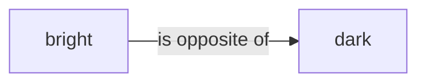
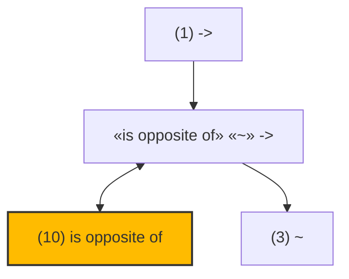
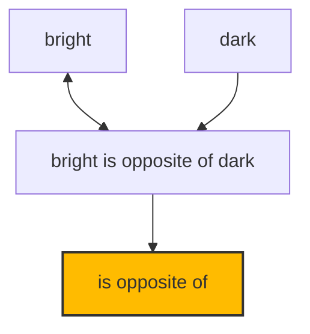

## Introduction

zelph is an innovative semantic network system that allows inference rules to be defined within the network itself.
This project provides a powerful foundation for knowledge representation and automated reasoning, with a special focus on efficiency and logical inference capabilities.
With dedicated import functions and specialized semantic scripts (like [wikidata.zph](https://github.com/acrion/zelph/blob/main/sample_scripts/wikidata.zph)),
zelph offers powerful analysis capabilities for the complete Wikidata knowledge graph while remaining adaptable for any semantic domain.

For an in-depth exploration of zelph's reasoning capabilities, including deep unification, negation, inequality constraints, and semantic arithmetic, see [Logic and Computation](logic.md).

### Video Presentation

Watch this video introduction to zelph, presented at the Wikidata Ontology Cleaning Task Force. For detailed section navigation and more context, visit the [full presentation page](presentation.md).

<video controls width="100%">
    <source src="https://zelph.org/assets/2026-01-13-zelph.mp4" type="video/mp4">
  Your browser does not support the video tag.
</video>

### Quick Start Guide 🚀

see [this page](quickstart.md)

### Community and Support

Development of zelph is supported by the [Wikimedia Community Fund](<https://meta.wikimedia.org/wiki/Grants:Programs/Wikimedia_Community_Fund/Rapid_Fund/zelph:Wikidata_Contradiction_Detection_and_Constraint_Integration_(ID:_23553409)>).

The project addresses real-world challenges in large-scale ontology management through direct collaboration with the [Wikidata Ontology Cleaning Task Force](https://www.wikidata.org/wiki/Wikidata:WikiProject_Ontology/Cleaning_Task_Force) and the [Mereology Task Force](https://www.wikidata.org/wiki/Wikidata_talk:WikiProject_Ontology/Mereology_Task_Force).

### Components

The zelph ecosystem includes:

- A core C++ library providing both C++ and C interfaces
- A single command-line binary that offers both interactive usage (CLI) and batch processing capabilities
- API functions beyond what's available in the command-line interface
- Integration options for languages like Go and Lua through the C interface

The key features of zelph include:

- Representation of knowledge in a semantic network structure
- Rules encoded within the same semantic network as facts
- Support for multi-language node naming
- Contradiction detection and resolution
- Memory-efficient data structures optimized at bit level
- A flexible scripting language for knowledge definition and querying
- Built-in import functionality for Wikidata JSON datasets and general binary save/load

## Core Concepts

### Semantic Network Structure

In zelph, knowledge is represented as a network of nodes connected by relations.
Unlike traditional semantic networks where relations are labeled edges,
zelph treats relation types as first-class nodes themselves.
This unique approach enables powerful meta-reasoning about relations.

### Predefined Core Nodes

zelph initializes with a small set of fundamental nodes that define the ontology of the system. These nodes are available in every language setting (though their names can be localized).

| Core Node                | Symbol        | Internal Name          | Description                                                                                                                            |
| :----------------------- | :------------ | :--------------------- | :------------------------------------------------------------------------------------------------------------------------------------- |
| **RelationTypeCategory** | `->`          | `RelationTypeCategory` | The meta-category of all relations. Every relation predicate in zelph is an instance (`~`) of this node.                               |
| **IsA**                  | `~`           | `IsA`                  | The fundamental categorical relation. Used for classification, e.g. to classify a Set as a Conjunction.                                |
| **Causes**               | `=>`          | `Causes`               | Defines inference rules. Connects a condition set to a consequence.                                                                    |
| **PartOf**               | `in`          | `PartOf`               | Defines membership in Sets.                                                                                                            |
| **Cons**                 | `cons`        | `Cons`                 | The fundamental list-building relation (Lisp-style). The subject is the first element (car), the object is the rest of the list (cdr). |
| **Nil**                  | `nil`         | `Nil`                  | The empty list terminator. Marks the end of a cons-list.                                                                               |
| **Conjunction**          | `conjunction` | `Conjunction`          | A tag used to mark a Set as a logical AND condition for rules.                                                                         |
| **Unequal**              | `!=`          | `Unequal`              | Used to define constraints (e.g., `X != Y`) within rules.                                                                              |
| **Negation**             | `negation`    | `Negation`             | Used to classify a condition in a rule as negative (match if the fact does _not_ exist).                                               |
| **Contradiction**        | `!`           | `Contradiction`        | The result of a rule that detects a logical inconsistency.                                                                             |

These nodes are the "axioms" of zelph's graph. For example, `~` is defined as an instance of `->` (i.e., "IsA" is a "Relation Type"). This self-referential bootstrapping allows zelph to reason about its own structure.

### Homoiconicity: The Executable Graph

A defining characteristic of zelph is its [homoiconicity](https://en.wikipedia.org/wiki/Homoiconicity): logic (code) and facts (data) share the exact same representation.
Rules are not separate scripts; they are topological structures within the graph.
Math is not hard-coded; numbers are cons-lists of digit nodes that interact with semantic entities through the same rule mechanism.

This means the graph doesn't just _describe_ knowledge; it _structures the execution_ of logic.
For a detailed exploration of this concept and its implications for computation, see [Logic and Computation](logic.md).

### Facts and Relations

A _fact_ in zelph is a statement node created from a **subject**, a **predicate**, and an _object_:

```
subject predicate object
```

A predefined predicate is `~`, used for classification:

```
X ~ Y
```

This can be read as "X is an instance of class Y", but depends on the context of your dataset. It is used in zelph's [internal topology](#internal-representation-of-facts) — there is no need to actually use it in your scripts.

#### Working with Custom Relations

zelph can use any predicate node, not just `~`:

```
zelph> bright "is opposite of" dark
bright   is opposite of   dark
```

In this example, using the interactive REPL, we enter a subject-predicate-object triple.
Neither "bright", "dark" nor "is opposite of" is know to zelph prior this command.
It automatically creates the appropiate nodes and edges in the semantic network.
After doing so, in the second line this topology is parsed and printed to verify the process ran as expected.

Note that when a relation contains spaces, it must be enclosed in quotation marks.

Predicates are completely generic: symbolic predicates such as `..`, `-->`, or `<=` are treated in the same way as word-like predicates such as `followed-by` or `is capital of`.

### Nested Expressions and Sets

zelph supports advanced grouping and recursion using parentheses `()`, braces `{}`, and angle brackets `<>`.

#### Parentheses: Nested Facts

A parenthesised statement `(s p o)` creates the fact and evaluates to the **statement node** (i.e. the relation/fact node). This lets you make statements _about_ statements:

```
(bright "is opposite of" dark) "is a" "symmetric relation"
```

Here, the subject of the outer statement is the node representing the inner fact.

> Note: A line consisting of only a bare nested fact like `(subject rel object)` is not a valid _top-level_ statement in the REPL; nested facts are meant to be used _as parts_ of a larger statement.

#### Braces: Sets

Braces `{...}` are used to create **unordered sets** of nodes or facts. This is primarily used for defining conditions in rules (see below).

```
{ (A "is part of" B) (B "is part of" C) }
```

Example session:

```
zelph> { elem1 elem2 elem3 }
{ elem1   elem2   elem3 }
zelph> A in { elem1 elem2 elem3 }
A  in  { elem1   elem2   elem3 }
Answer:   elem3    in  { elem1   elem2   elem3 }
Answer:   elem2    in  { elem1   elem2   elem3 }
Answer:   elem1    in  { elem1   elem2   elem3 }
zelph> (*{(A "is part of" B) (B "is part of" C) } ~ conjunction) => (A "is part of" C)
{B  is part of  C A  is part of  B} => (A  is part of  C)
zelph> earth "is part of" "solar system"
  earth    is part of  ( solar system )
zelph> "solar system" "is part of" universe
( solar system )  is part of    universe
  earth    is part of    universe   ⇐ {( solar system )  is part of    universe     earth    is part of  ( solar system )}
zelph>
```

##### Set Topology

A set `{A B C}` creates a **Super-Node** (representing the set itself).
The elements are linked to this super-node via the `in` (PartOf) relation.

- **Syntax:** `{A B}`
- **Facts created:**
  - `A in SetNode`
  - `B in SetNode`

#### Angle Brackets: Lists

Angle brackets `<...>` create **ordered lists** implemented as classic Lisp-style cons lists using the core predicates `cons` and `nil`.

A list is represented by the **outermost cons cell**. There is **no separate container node**: the node returned by list construction _is_ the list (exactly as in Lisp).

---

##### Two list syntaxes

zelph supports two input modes that both create cons lists:

1. **Node Lists (space-separated):** `<item1 item2 item3>`
   - **Syntax:** At least one whitespace between elements.
   - **Semantics:** The elements are existing nodes (`item1`, `item2`, …) and the list preserves this order.
   - **Construction:** Built right-to-left:
     - `Cell3 = item3 cons nil`
     - `Cell2 = item2 cons Cell3`
     - `Cell1 = item1 cons Cell2` ← this outermost cons cell **is the list**

2. **Compact Lists (continuous characters):** `<abc>`
   - **Syntax:** No spaces inside the brackets.
   - **Semantics:** The input is split into individual characters. Each character is resolved to a named node (e.g. `"a"`, `"b"`, `"c"`), and these become the list elements.
   - **Construction detail:** Before building the cons list, the character sequence is **reversed**.  
     So `"abc"` becomes the element vector `["c","b","a"]`, yielding: - `Cell3 = "a" cons nil` - `Cell2 = "b" cons Cell3` - `Cell1 = "c" cons Cell2`

This reversal is **not** "numeric logic" — it is simply the definition of the compact syntax and is useful for many right-to-left processing rules (including, but not limited to, arithmetic scripts).

Because of this rule, `<abc>` is internally identical to the explicit node list `<c b a>`.

---

##### Referring to the _same_ cons list in different ways

The list node is the **outermost cons cell**. You can refer to the same list topology using any of these equivalent notations:

1. **Explicit cons chain (nested facts)**

```
(3 cons (1 cons nil))
```

2. **Compact list syntax** (character splitting + reversal rule)

```
<13>
```

3. **Node-list syntax** (space-separated elements)

```
<3 1>
```

Example session:

```
zelph> (3 cons (1 cons nil)) is prime
<13>  is   prime
zelph> <13> is prime
<13>  is   prime
zelph> <3 1> is prime
<13>  is   prime
```

Why this works:

- `<13>` is parsed as a compact list of characters `"1"` and `"3"`, **reversed before cons construction**, so it becomes the same internal cons chain as `<3 1>`.
- `node_to_string` may print certain lists in compact form (e.g. single-character elements) as a **display heuristic**. This does not change the underlying graph structure.

> To avoid confusion: `<13>` is list syntax, **not** a numeric node ID. Numeric IDs are shown elsewhere in parentheses (e.g. `(10)` in Mermaid graphs).

---

##### Display: compact vs. spaced

When a list consists entirely of single-character named nodes, it is printed in a reversed compact form without spaces, e.g. `<abc>`.  
This is a **display heuristic only**. It does not change the underlying topology or impose any numeric meaning.

---

##### Digits vs. numbers (emergent, not built-in)

The cons-list representation naturally distinguishes between:

- a **character node** such as `"4"` (a normal named node), and
- a **single-element list** `( "4" cons nil )` (a different node: a cons cell)

Whether you interpret `"4"` as a digit, or `( "4" cons nil )` as the number four, is entirely up to your rule system (e.g. [arithmetic.zph](https://github.com/acrion/zelph/blob/main/sample_scripts/arithmetic.zph)) and any external naming/mapping you choose to apply. For a detailed exploration of how rules can define arithmetic over these structures, see [Semantic Math](logic.md#semantic-math-computation-as-graph-rewriting).

#### The Focus Operator `*`

When defining complex structures, you often need to refer to a specific part of an expression rather than the resulting fact node. The `*` operator allows you to "focus" or "dereference" a specific element to be returned.

- `(A B C)` creates the fact and returns the relation node.
- `(*A B C)` creates the fact and returns node `A`.
- `(*{...} ~ conjunction)` creates the fact that the set is a conjunction, but **returns the set node itself**.

This operator is crucial for the rule syntax.

**Example — typing a node via a nested fact:**

The focus operator lets you create a fact and use its subject in an outer statement in a single expression:

```
zelph> (*tim ~ human) ~ male
  tim    ~   male
zelph> tim _predicate _object
Answer:   tim    ~   human
Answer:   tim    ~   male
```

The inner expression `(*tim ~ human)` creates the fact `tim ~ human` and — thanks to the `*` prefix — returns the node `tim` rather than the statement node. That returned node becomes the subject of the outer `~ male` relation, so `tim ~ male` is created as well.

Querying `tim _predicate _object` (where leading underscores indicate variables, equivalent to using single uppercase letters) confirms that both facts are in the graph.

## Creating a node graph

You can generate a node graph yourself using zelph's `.mermaid` command, which outputs a Mermaid HTML format file. For example:

```
.mermaid name 3
```

In this example, `name` refers to the node identifier (in the currently active language specified via the `.lang` command) whose connections you want to visualise. The following number represents the depth of connections to include in the graph (default is 3).

To view the Mermaid graph, open the generated HTML file in a web browser.

## Rules and Inference

One of zelph's most powerful features is the ability to define inference rules within the same network as facts. Rules are statements containing `=>` with conditions before it and a consequence after it.

For an in-depth treatment of zelph's rule system — including deep unification, negation as failure, inequality constraints, fresh variables, and the formal connection to predicate logic — see [Logic and Computation](logic.md).

### Rule Syntax

A rule in zelph is formally a statement where the subject is a **set of conditions** (marked as a conjunction) and the object is the **consequence**.

Example rule:

```
(*{(R ~ transitive) (X R Y) (Y R Z)} ~ conjunction) => (X R Z)
```

**Breakdown of the syntax:**

1. `{...}`: Creates a **Set** containing three fact templates:
   - `R` is a transitive relation.
   - `X` is related to `Y` via `R`.
   - `Y` is related to `Z` via `R`.
2. `~ conjunction`: Defines that this Set represents a logical "AND" (Conjunction). The inference engine only evaluates sets marked as conjunctions.
3. `(*...)`: The surrounding parentheses create the fact `Set ~ conjunction`.
4. `*`: The **Focus Operator** at the beginning ensures that the expression returns the **Set Node** itself, not the fact node `Set ~ conjunction`.
5. `=>`: The inference operator. It links the condition Set (Subject) to the consequence (Object).
6. `(X R Z)`: The consequence fact.

This rule states: _If there exists a set of facts matching the pattern in the conjunction, then the fact `X R Z` is deduced._

#### Syntax Sugar for Conditions

A parenthesised group that contains commas is parsed as **conjunction syntax sugar**:

```
(cond1, cond2, cond3)
```

Each comma-separated condition is itself a normal zelph statement fragment (either a fact pattern like `X R Y`, or a nested expression). The whole parenthesised expression evaluates to a **set node** that is automatically tagged as a conjunction internally (i.e. it desugars to the same topology as `(*{...} ~ conjunction)`).

Practical consequence: you can write the above example rule as

```
(R ~ transitive, X R Y, Y R Z) => (X R Z)
```

without using the set syntax `{...}` or the `conjunction` core node.

### Examples

Here is a practical example of how a transitive-closure rule works in zelph (which you can also try out in interactive mode):

```
zelph> (R is transitive, A R B, B R C) => (A R C)
{(A R B) (R  is   transitive ) (B R C)} => (A R C)
```

After the entered rule, we see zelph's output, which in this case simply confirms the input of the rule.

Now, let's declare that the relation `>` (greater than) is an instance of transitive relations:

```
zelph> > is transitive
>  is   transitive
```

Next, we provide three elements ("4", "5" and "6") for which the `>` relation applies:

```
zelph> 6 > 5
 6  >  5
zelph> 5 > 4
 5  >  4
 6  >  4  ⇐ {( 6  >  5 ) (>  is   transitive ) ( 5  >  4 )}
zelph>
```

After entering `5 > 4`, zelph's unification mechanism takes effect and automatically adds a new fact: `6 > 4`. This demonstrates the power of the transitive relation rule in action. Note that the rule uses `R` as a variable for the predicate itself — this is possible because predicates are first-class nodes in the graph, not edge labels. Any relation that is declared `is transitive` will automatically benefit from this single rule.

Rules can also define contradictions using `!`:

```
zelph> (X "is opposite of" Y, A ~ X, A ~ Y, X != Y) => !
{(X  is opposite of  Y) (A  ~  X) (X  !=  Y) (A  ~  Y)} =>  !
zelph> bright "is opposite of" dark
 bright   is opposite of   dark
zelph> yellow ~ bright
 yellow   ~   bright
zelph> yellow ~ dark
 yellow   ~   dark
 !  ⇐ {( bright   is opposite of   dark ) ( yellow   ~   bright ) ( bright   !=   dark ) ( yellow   ~   dark )}
Found one or more contradictions!
zelph>
```

This rule states that if X is opposite of Y and X ≠ Y, then an entity A cannot be both an instance of X and an instance of Y, as this would be a contradiction. The `X != Y` guard is essential here: without it, a reflexive fact like `bright "is opposite of" bright` could cause a spurious contradiction when `yellow ~ bright` is entered, because `X` and `Y` would both bind to `bright` (see [Inequality Constraints](logic.md#inequality-constraints) for a detailed discussion).

If a contradiction is detected when a fact is entered (via the scripting language or during import of Wikidata data), the corresponding relation (the fact) is not entered into the semantic network. Instead, a fact is entered that describes this contradiction (making it visible in the Markdown export of the facts).

### Internal Representation of facts

In a conventional semantic network, relations between nodes are labeled, e.g.


```mermaid
graph LR
    bright -->|is opposite of| dark
```

zelph's representation of relation types works fundamentally differently.
As mentioned in the introduction, one of zelph's distinguishing features is that it treats relation types as first-class nodes rather than as mere edge labels.

Internally, zelph creates special nodes to represent relations.
For example,when identifying "is opposite of" as a relation (predicate), this internal structure is created:


```mermaid
graph TD
    n_3["(3) ~"]
    n_1["(1) ->"]
    n_5688216769861436680["«is opposite of» «~» ->"]
    n_10["(10) is opposite of"]
    style n_10 fill:#FFBB00,stroke:#333,stroke-width:2px
    n_5688216769861436680 <--> n_10
    n_1 --> n_5688216769861436680
    n_5688216769861436680 --> n_3
```

The nodes `->` and `~` are predefined zelph nodes. `->` represents the category of all relations, while `~` represents a subset of this category, namely the category of categorical relations. Every relation that differs from the standard relation `~` (like "is opposite of") is linked to `->` via a `~` relation.

The node `is opposite of ~ ->` represents this specific relation (hence its name).
The relations to other nodes encode its meaning.

This approach provides several advantages:

1. It enables meta-reasoning about relations themselves
2. It simplifies the underlying data structures
3. It allows relations to participate in other relations (higher-order relations)
4. It provides a unified representation mechanism for both facts and rules

This architecture is particularly valuable when working with knowledge bases like Wikidata, where relations (called "properties" in Wikidata terminology) are themselves first-class entities with their own attributes, constraints, and relationships to other entities. zelph's approach naturally aligns with Wikidata's conceptual model, allowing for seamless representation and inference across the entire knowledge graph.

Similarly, when stating:

```
bright "is opposite of" dark
```

zelph creates a special relation node that connects the subject "bright" bidirectionally, the object "dark" in reverse direction, and the relation type "is opposite of" in the forward direction.


```mermaid
graph TD
    n_11["dark"]
    n_9["bright"]
    n_8445031417147704759["bright is opposite of dark"]
    n_10["is opposite of"]
    style n_10 fill:#FFBB00,stroke:#333,stroke-width:2px
    n_8445031417147704759 --> n_10
    n_9 <--> n_8445031417147704759
    n_11 --> n_8445031417147704759
```

The directions of the relations are as follows:

| Element       | Example        | Relation Direction |
| ------------- | -------------- | ------------------ |
| Subject       | white          | bidirectional      |
| Object        | black          | backward           |
| Relation Type | is opposite of | forward            |

This semantics is used by zelph in several contexts, such as rule unification. It's required because zelph doesn't encode relation types as labels on arrows but rather as equal nodes. This has the advantage of facilitating statements about statements, for example, the statement that a relation is transitive.

zelph also supports **self-referential facts**, where subject and object are the same
node (e.g., `A cons A`). These arise rarely in practice — Wikidata contains a small
number of such entries, for example `South Africa (Q258) country (P17) South Africa
(Q258)`. Internally, the object connection is omitted because the subject is already
connected to the fact-node bidirectionally, which serves as the implicit object
connection. Detection is unambiguous: a fact-node whose left-neighbor set contains
only the subject node (no additional unidirectional incoming connection) is
self-referential.

### Internal representation of rules

Rules are not stored in a separate list; they are an integral part of the semantic network. The implication operator `=>` is treated as a standard relation node.

When you define:
`(*{A B} ~ conjunction) => C`

The following topology is created in the graph:

1. A node `S` is created to represent the set of conditions.
2. The conditions `A` and `B` are linked to `S` via `PartOf` relations.
3. A fact node represents `S ~ conjunction` (defining the logical AND).
4. A fact node represents `S => C` (the rule itself).

When the inference engine scans for rules, it looks for all facts involving the `=>` relation. It examines the subject (the set `S`), verifies that `S` is connected to `conjunction` via `~`, and if so, treats the elements of `S` as the condition patterns.

This means that **a rule is completely represented by standard subject-predicate-object triples**, with `=>` serving as a standard predicate.

### Facts and Rules in One Network: Unique Identification via Topological Semantics

A distinctive aspect of **zelph** is that **facts and rules live in the same semantic network**. That raises a natural question: how does the unification engine avoid confusing ordinary entities with statement nodes, and how does it keep rule matching unambiguous?

The answer lies in the network's **strict topological semantics** (see [Internal Representation of facts](#internal-representation-of-facts) and [Internal representation of rules](#internal-representation-of-rules)). In zelph, a _statement node_ is not "just a node with a long label"; it has a **unique structural signature**:

- **Bidirectional** connection to its **subject**
- **Forward** connection to its **relation type** (a first-class node)
- **Backward** connection to its **object**

The unification engine is **hard-wired to search only for this pattern** when matching a rule's conditions. In other words, a variable that ranges over "statements" can only unify with nodes that expose exactly this subject/rel/type/object wiring. Conversely, variables intended to stand for ordinary entities cannot accidentally match a statement node, because ordinary entities **lack** that tri-partite signature.

Two immediate consequences follow:

1. **Unambiguous matching.** The matcher cannot mistake an entity for a statement or vice versa; they occupy disjoint topological roles.
2. **Network stability.** Because statementhood is encoded structurally, rules cannot "drift" into unintended parts of the graph. This design prevents spurious matches and the sort of runaway growth that would result if arbitrary nodes could pose as statements.

## Performing Inference

By default, zelph triggers the inference engine immediately after every fact or rule is entered. You can toggle this behaviour using the `.auto-run` command.

**Performance Note:** When working with large datasets, continuous inference can be computationally expensive. Therefore, the `.load` command automatically **disables** auto-run mode to ensure efficient data loading. You can re-enable it manually at any time by typing `.auto-run`.

Queries containing variables (e.g., `A "is capital of" Germany`) are always evaluated immediately, regardless of the auto-run setting.

If auto-run is disabled, you can trigger inference manually:

```
.run
```

This performs full inference: rules are applied repeatedly until no new facts can be derived. New deductions are printed as they are found.

For a single inference pass:

```
.run-once
```

To export all deductions and contradictions as structured Markdown reports:

```
.run-md <subdir>
```

This command generates a tree of Markdown files in `mkdocs/docs/<subdir>/` (the directory `mkdocs/docs/` must already exist in the current working directory).  
It is intended for integrating detailed reports into an existing MkDocs site – this is exactly how the contradiction and deduction reports on <https://zelph.org> were produced.  
For normal interactive or script use, `.run` is the standard command.

### Exporting Deduced Facts to File

The command `.run-file <path>` performs full inference (like `.run`) but additionally writes every deduced fact (positive deductions and contradictions) to the specified file – one per line.

Key characteristics of the file output:

- **Reversed order**: The reasoning chain comes first, followed by `⇒` and then the conclusion (or `!` for contradictions).
- **Clean format**: No `«»` markup, no parentheses, no additional explanations – only the pure facts.
- **Console output unchanged**: On the terminal you still see the normal format with `⇐` explanations and markup.

The command is **general-purpose** and works with any language setting. It simply collects all deductions in a clean, machine-readable text file.

Example session:

```
zelph> .lang wikidata
wikidata> .auto-run
Auto-run is now disabled.
wikidata-> Q1 P279 Q2
 Q1   P279   Q2
wikidata-> Q2 P279 Q3
 Q2   P279   Q3
wikidata-> (*{(A P279 B) (B P279 C)} ~ conjunction) => (A P279 C)
{(B  P279  C) (A  P279  B)} => (A  P279  C)
wikidata-> .run-file /tmp/output.txt
Starting full inference in encode mode – deduced facts (reversed order, no brackets/markup) will be written to /tmp/output.txt (with Wikidata token encoding).
«Q1» «P279» «Q3» ⇐ {(«Q2» «P279» «Q3») («Q1» «P279» «Q2»)}
```

Content of `output.txt`:

```
丂 一丂 七, 七 一丂 丄 ⇒ 丂 一七 丄
```

When the current language is set to `wikidata` (via `.lang wikidata`), the output is **automatically compressed** using a dense encoding that maps Q/P identifiers to CJK characters.
This dramatically reduces file size and – crucially – makes the data highly suitable for training or prompting large language models (LLMs).
Standard tokenizers struggle with long numeric identifiers (Q123456789), often splitting them into many sub-tokens.
The compact CJK encoding avoids this problem entirely, enabling efficient fine-tuning or continuation tasks on Wikidata-derived logical data.

To read an encoded file back in human-readable form, use `.decode`, e.g.:

```
zelph> .decode /tmp/output.txt
Q2 P279 Q3 Q1 P279 Q2 ⇒ Q1 P279 Q3
```

`.decode` prints each line decoded (if it was encoded) using Wikidata identifiers.

## Example Script

Here's an example demonstrating zelph's capabilities:

```
(X "is a" Y) => (X ~ Y)
(X "is an" Y) => (X "is a" Y)

"is attribute of" "is opposite of" is
"is part of"      "is opposite of" "has part"
"is for example"  "is opposite of" "is a"

"has part"      is transitive
"has attribute" is transitive
~               is transitive

(R is transitive, X R Y, Y R Z) => (X R Z)
(X is E, E "is a" K) => (X is K)
(X "has part" P, P "is a" K) => (X "has part" K)
(K is E, X "is a" K) => (X is E)
(K "has part" P, X "is a" K) => (X "has part" P)
(X "is opposite of" Y, X "is a" K) => (Y "is a" K)
(X "is opposite of" Y) => (Y "is opposite of" X)
(R "is opposite of" S, X R Y) => (Y S X)

(X "is opposite of" Y, A is X, A is Y) => !
(X "is opposite of" Y, A "has part" X, A "has part" Y) => !
(X "is opposite of" Y, A "is a" X, A "is a" Y) => !
(X is E, X "is a" E) => !
(X is E, E "is a" X) => !
(X is E, E "has part" X) => !

"is needed by" "is opposite of" needs
"is generated by" "is opposite of" generates

"is needed by" "is opposite of" needs
"is generated by" "is opposite of" generates

(X generates energy) => (X "is an" "energy source")
(A is hot) => (A generates heat)
(A generates "oxygen") => (A is alive)

chimpanzee "is an" ape
ape is alive

chimpanzee "has part" hand
hand "has part" finger

"green mint" "is an" mint

"water mint" "is a" mint

peppermint "is a" mint

mint "is a" lamiacea

catnip "is a" lamiacea

"green mint" is sweet

"is ancestor of" is transitive
peter "is ancestor of" paul
paul "is ancestor of" "pius"
A "is ancestor of" "pius"
```

When executed, the last line is interpreted as a query, because it contains a variable (single uppercase letter) and is no rule. Here are the results:

```
zelph> .import sample_scripts/english.zph
Importing file sample_scripts/english.zph...
[...skipped repetition of parsed commands..]
Answer: paul is ancestor of pius
( peppermint ~ mint ) ⇐ ( peppermint is a mint )
( catnip ~ lamiacea ) ⇐ ( catnip is a lamiacea )
( mint ~ lamiacea ) ⇐ ( mint is a lamiacea )
( water mint ~ mint ) ⇐ ( water mint is a mint )
( water mint ~ lamiacea ) ⇐ {( water mint ~ mint ) ( ~ is transitive ) ( mint ~ lamiacea )}
( peppermint ~ lamiacea ) ⇐ {( peppermint ~ mint ) ( ~ is transitive ) ( mint ~ lamiacea )}
( peter is ancestor of pius ) ⇐ {( peter is ancestor of paul ) ( is ancestor of is transitive ) ( paul is ancestor of pius )}
( chimpanzee has part finger ) ⇐ {( chimpanzee has part hand ) ( has part is transitive ) ( hand has part finger )}
( chimpanzee is a ape ) ⇐ ( chimpanzee is an ape )
( green mint is a mint ) ⇐ ( green mint is an mint )
( has part is opposite of is part of ) ⇐ ( is part of is opposite of has part )
( needs is opposite of is needed by ) ⇐ ( is needed by is opposite of needs )
( generates is opposite of is generated by ) ⇐ ( is generated by is opposite of generates )
( is a is opposite of is for example ) ⇐ ( is for example is opposite of is a )
( is is opposite of is attribute of ) ⇐ ( is attribute of is opposite of is )
( chimpanzee ~ ape ) ⇐ ( chimpanzee is a ape )
( green mint ~ mint ) ⇐ ( green mint is a mint )
( chimpanzee is alive ) ⇐ {( chimpanzee is a ape ) ( ape is alive )}
( mint is for example peppermint ) ⇐ {( peppermint is a mint ) ( is a is opposite of is for example )}
( lamiacea is for example catnip ) ⇐ {( catnip is a lamiacea ) ( is a is opposite of is for example )}
( ape is for example chimpanzee ) ⇐ {( chimpanzee is a ape ) ( is a is opposite of is for example )}
( lamiacea is for example mint ) ⇐ {( mint is a lamiacea ) ( is a is opposite of is for example )}
( mint is for example water mint ) ⇐ {( water mint is a mint ) ( is a is opposite of is for example )}
( mint is for example green mint ) ⇐ {( green mint is a mint ) ( is a is opposite of is for example )}
( transitive is attribute of has attribute ) ⇐ {( has attribute is transitive ) ( is is opposite of is attribute of )}
( transitive is attribute of ~ ) ⇐ {( ~ is transitive ) ( is is opposite of is attribute of )}
( transitive is attribute of is ancestor of ) ⇐ {( is ancestor of is transitive ) ( is is opposite of is attribute of )}
( alive is attribute of chimpanzee ) ⇐ {( chimpanzee is alive ) ( is is opposite of is attribute of )}
( sweet is attribute of green mint ) ⇐ {( green mint is sweet ) ( is is opposite of is attribute of )}
( alive is attribute of ape ) ⇐ {( ape is alive ) ( is is opposite of is attribute of )}
( transitive is attribute of has part ) ⇐ {( has part is transitive ) ( is is opposite of is attribute of )}
( hand is part of chimpanzee ) ⇐ {( chimpanzee has part hand ) ( has part is opposite of is part of )}
( finger is part of hand ) ⇐ {( hand has part finger ) ( has part is opposite of is part of )}
( finger is part of chimpanzee ) ⇐ {( chimpanzee has part finger ) ( has part is opposite of is part of )}
( green mint ~ lamiacea ) ⇐ {( green mint ~ mint ) ( ~ is transitive ) ( mint ~ lamiacea )}
```

The results demonstrate zelph's powerful inference capabilities.
It not only answers the specific query about who is an ancestor of pius, but it also derives numerous other facts based on the rules and base facts provided in the script.

## Multi-language Support

zelph allows nodes to have names in multiple languages. This feature is particularly useful when integrating with external knowledge bases. The preferred language can be set in scripts using the `.lang` command:

```
.lang zelph
```

This capability is fully utilized in the Wikidata integration, where node names include both human-readable labels and Wikidata identifiers. An item in zelph can be assigned names in any number of languages, with Wikidata IDs being handled as a specific language ("wikidata").

## Project Status

The project is currently in beta phase. The core functionality has been rigorously tested against the full Wikidata dataset and is operational.
Comprehensive automated tests are run with every commit, see https://github.com/acrion/zelph/blob/main/src/test/test_interactive.cpp

Current focus areas include:

- **Graph-based arithmetic and symbolic computation**: zelph now supports rule-based multi-digit addition as a proof of concept for computation that emerges purely from graph topology (see [Logic and Computation](logic.md#semantic-math-computation-as-graph-rewriting)). This opens pathways towards using zelph as a foundation for formal reasoning and symbolic mathematics — a direction that bears some resemblance to [Lean](https://lean-lang.org), but which is based on a graph-native, homoiconic representation.
- **Transitive reasoning and Wikidata integration**: A [second Wikimedia Rapid Fund proposal](<https://meta.wikimedia.org/wiki/Grants:Programs/Wikimedia_Community_Fund/Rapid_Fund/zelph:Transitive_Reasoning,_Qualifier_Support,_and_SPARQL-Subset_Integration_(ID:_23759260)>) targets transitive reasoning over Wikidata's subclass hierarchy, qualifier support, and SPARQL-subset integration — capabilities that also serve as building blocks for more general symbolic computation.
- **Potential Wikidata integration**: Exploring pathways for integration with the Wikidata ecosystem, e.g. the [WikiProject Ontology](https://www.wikidata.org/wiki/Wikidata:WikiProject_Ontology).

Regarding potential Wikidata integration and the enhancement of semantic scripts, collaboration with domain experts would be particularly valuable. Expert input on conceptual alignment and implementation of best practices would significantly accelerate development and ensure optimal compatibility with existing Wikidata infrastructure and standards.

## Building zelph

You need:

- C++ compiler (supporting at least C++20)
- CMake 3.25.2+
- Git

### Build Instructions

1. Clone the repository with all submodules:

```bash
git clone --recurse-submodules https://github.com/acrion/zelph.git
```

2. Configure the build (Release mode):

```bash
cmake -D CMAKE_BUILD_TYPE=Release -B build .
```

3. Build the project (for MSVC, add `--config Release`):

```bash
cmake --build build
```

### Verifying the Build

Test your installation by running the CLI:

```bash
./build/bin/zelph
```

or

```bash
./build/bin/zelph sample_scripts/english.zph
```

## Licensing

zelph is dual-licensed:

1. **AGPL v3 or later** for open-source use,
2. **Commercial licensing** for closed-source integration or special requirements.

We would like to emphasize that offering a dual license does not restrict users of the normal open-source license (including commercial users).
The dual licensing model is designed to support both open-source collaboration and commercial integration needs.
For commercial licensing inquiries, please contact us at [https://acrion.ch/sales](https://acrion.ch/sales).
