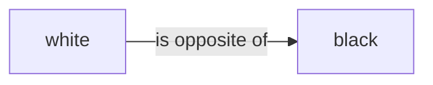
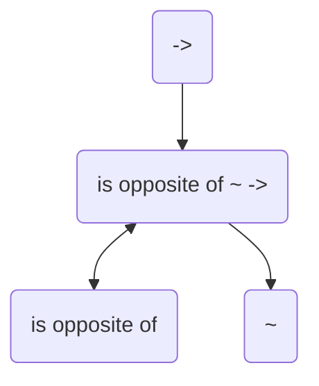
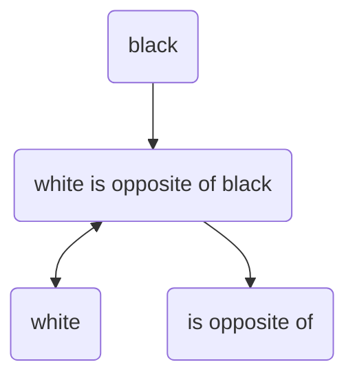
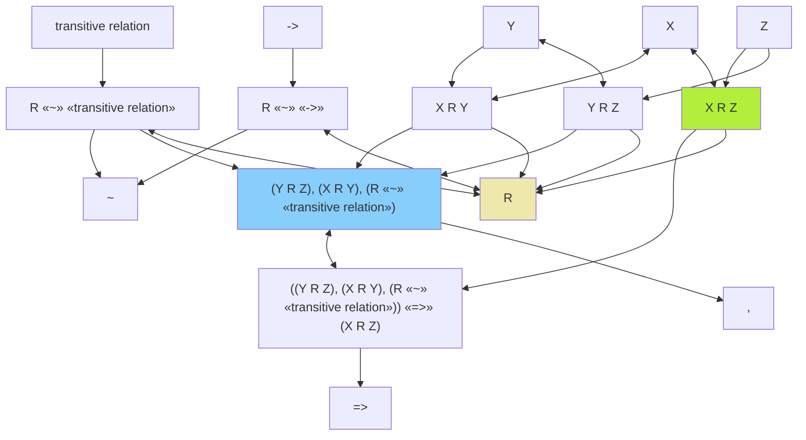

# zelph: A Sophisticated Semantic Network System

## Introduction

zelph is an innovative semantic network system that allows inference rules to be defined within the network itself.
This project provides a powerful foundation for knowledge representation and automated reasoning, with a special focus on efficient memory usage and logical inference capabilities.
With dedicated import functions and specialized semantic scripts (like [wikidata.zph](https://github.com/acrion/zelph/blob/main/sample_scripts/wikidata.zph)),
zelph offers powerful analysis capabilities for the complete Wikidata knowledge graph while remaining adaptable for any semantic domain.

The zelph ecosystem includes:

- A core C++ library providing both C++ and C interfaces
- A single command-line binary that offers both interactive usage (CLI) and batch processing capabilities
- API functions beyond what’s available in the command-line interface
- Integration options for languages like Go and Lua through the C interface

The key features of zelph include:

- Representation of knowledge in a semantic network structure
- Rules encoded within the same semantic network as facts
- Support for multi-language node naming
- Contradiction detection and resolution
- Memory-efficient data structures optimized at bit level
- A flexible scripting language for knowledge definition and querying
- Built-in import functionality for Wikidata JSON datasets

## Core Concepts

### Semantic Network Structure

In zelph, knowledge is represented as a network of nodes connected by relations.
Unlike traditional semantic networks where relations are labeled edges,
zelph treats relation types as first-class nodes themselves.
This unique approach enables powerful meta-reasoning about relations.

### Facts and Relations

Facts in zelph are represented as triples consisting of a subject, relation type, and object.
The standard relation type is `~`, which represents a categorical relation (similar to "is a" or "instance of").
For example:

```
X ~ Y
```

This means "X is an instance of category Y" or "X is a Y".

#### Working with Custom Relations

zelph can work with any type of relation, not just the standard `~` relation.
Here’s how custom relations work:

```
is opposite of ~ ->
> «is opposite of» «~» «->»
white is opposite of black
> «white» «is opposite of» «black»
```

In this example, using the interactive CLI, the first line declares "is opposite of" as a relation type (a member of the `->` category).
After the `>` symbol, we see zelph’s responses.

zelph creates new relation types automatically as needed. The explicit declaration of "is opposite of" can actually be omitted:

```
white "is opposite of" black
> «white» «is opposite of» «black»
```

Here, zelph automatically recognizes that "is opposite of" must be a relation type.
Note that when a relation contains spaces and is being used for the first time, it must be enclosed in quotation marks.
Once the relation is known to zelph, the quotation marks are no longer necessary in subsequent usage.

### Internal Representation of facts

In a conventional semantic network, relations between nodes are labeled, e.g.



zelph’s representation of relation types works fundamentally differently.
As mentioned in the introduction, one of zelph’s distinguishing features is that it treats relation types as first-class nodes rather than as mere edge labels.

At the network level, there is only a single primitive relation type: `~`, which represents a general category relation.
Far from being a limitation, this is actually one of zelph’s most powerful characteristics.
Relations that differ from the basic `~` type are not represented as arrow labels in zelph, but as regular nodes with the same status as any other node in the network.

Internally, zelph creates special nodes to represent relations. For example, when defining:

```
"is opposite of" ~ ->
```

This tells zelph that "is opposite of" is a relation (represented by `->`, which is the category of all relations).
zelph creates a special node to represent this fact.

This can be visualized as follows:



The nodes `->` and `~` are predefined zelph nodes. `->` represents the category of all relations, while `~` represents a subset of this category, namely the category of categorical relations. Every relation that differs from the standard relation `~` (like "is opposite of") is linked to `->` via a `~` relation.

The node `is opposite of ~ ->` represents this specific relation (hence its name).
The relations to other nodes encode its meaning.

This approach provides several advantages:

1. It enables meta-reasoning about relations themselves
2. It simplifies the underlying data structures
3. It allows relations to participate in other relations (higher-order relations)
4. It provides a unified representation mechanism for both facts and rules

This architecture is particularly valuable when working with knowledge bases like Wikidata, where relations (called "properties" in Wikidata terminology) are themselves first-class entities with their own attributes, constraints, and relationships. zelph’s approach naturally aligns with Wikidata’s conceptual model, allowing for seamless representation and inference across the entire knowledge graph.

Similarly, when stating:

```
white "is opposite of" black
```

zelph creates a special relation node that connects the subject "white" bidirectionally, the object "black" in reverse direction, and the relation type "is opposite of" in the forward direction.



The directions of the relations are as follows:

| Element        | Example        | Relation Direction |
|----------------|----------------|--------------------|
| Subject        | white          | bidirectional      |
| Object         | black          | backward           |
| Relation Type  | is opposite of | forward            |

This semantics is used by zelph in several contexts, such as rule unification. It’s required because zelph doesn’t encode relation types as labels on arrows but rather as equal nodes. This has the advantage of facilitating statements about statements, for example, the statement that a relation is transitive.

This design prevents subject and object from being identical in a relation. There are examples of this in Wikidata, e.g., "South Africa (Q258)" "country (P17)" "South Africa (Q258)". "South Africa" is thus linked to itself in Wikidata via the relation (property) "Country". These examples are extremely rare in Wikidata and are ignored during import, with a warning.

## Creating a node graph

You can generate a node graph yourself using zelph’s `.dot` command, which outputs a GraphViz DOT format file. For example:

```
.dot name 2
```

In this example, `name` refers to the node identifier (in the currently active language specified via the `.lang` command) whose connections you want to visualize. The following number represents the depth of connections to include in the graph.

To convert the DOT file into an actual image, use the GraphViz command-line tool as follows:

```bash
dot -Tpng -oname.svg name.dot
```

## Rules and Inference

One of zelph’s most powerful features is the ability to define inference rules within the same network as facts. Rules are statements containing `=>` with conditions before it and a consequence after it.

Example rule:

```
R ~ "transitive relation", X R Y, Y R Z => X R Z
```

This rule states that if R is a transitive relation, and X is related to Y by R, and Y is related to Z by R, then X is also related to Z by R.
Variables in the zelph syntax are currently single uppercase letters. This restricts the number of variables in a rule to 26.
Note that the scope of variables always is a single rule. Internally, more complex rules are possible, but this is currently
only supported via zelph’s API, not via the scripting interface. See [main.cpp](https://github.com/acrion/zelph/blob/main/src/app/main.cpp)
for an example on how to use the API.

Here is a practical example of how this rule works in zelph (which you can also try out in interactive mode):

```
R ~ transitive relation, X R Y, Y R Z => X R Z
> ((Y R Z), (X R Y), (R «~» «transitive relation»)) «=>» (X R Z)
```

After the `>` symbol, we see zelph’s output, which in this case simply confirms the input of the rule.
The brackets `()` indicate that their content is represented as a separate node - each condition is a separate node in the semantic network.

Now, let’s declare that the relation `>` (greater than) belongs to the category (`~`) of transitive relations:

```
> ~ transitive relation
> «>» «~» «transitive relation»
```

Next, we provide three elements ("4", "5" and "6") for which the `>` relation applies:

```
6 > 5
> «6» «>» «5»
5 > 4
> «5» «>» «4»
«6» «>» «4» ⇐ («5» «>» «4»), («6» «>» «5»), («>» «~» «transitive relation»)
```

After entering `5 > 4`, zelph’s unification mechanism takes effect and automatically adds a new fact: `6 > 4`. This demonstrates the power of the transitive relation rule in action.

Rules can also define contradictions using `!`:

```
X "is opposite of" Y, A ~ X, A ~ Y => !
```

This rule states that if X is opposite of Y, then an entity A cannot be both an X and a Y, as this would be a contradiction.

If a contradiction is detected when a fact is entered (via the scripting language or during import of Wikidata data), the corresponding relation (the fact) is not entered into the semantic network. Instead, a fact is entered that describes this contradiction (making it visible in the Markdown export of the facts).

### Internal representation of rules

Let’s explain the internal representation of rules based on the example rule above.
The complete rule graph looks like this:



This graph may seem somewhat overwhelming at first glance, but it follows a clear structure.
Let’s break it down:

1. The three conditions of the rule are connected to the blue condition node, which itself points to the logical operation of the condition: `,` (which represents the logical AND operation):
    ```mermaid
    graph TD
        n12["(Y R Z), (X R Y), (R «~» «transitive relation»)"] --> n13[","]
        n11["R «~» «transitive relation»"] --> n12
        n15["X R Y"] --> n12
        n18["Y R Z"] --> n12
        
        style n12 fill:#87CEFA
    ```
2. The blue condition node serves as the subject of the rule clause S => O (which is assigned the complete rule statement as a name). The green conclusion node functions as the object of the rule clause:
    ```mermaid
    graph TD
        n1["((Y R Z), (X R Y), (R «~» «transitive relation»)) «=>» (X R Z)"] --> n2["=>"]
        n12["(Y R Z), (X R Y), (R «~» «transitive relation»)"] <--> n1
        n16["X R Z"] --> n1
       
        style n12 fill:#87CEFA
        style n16 fill:#B3EE3A
    ```

3. Each condition, as well as the conclusion, is represented exactly like a fact (see the previous section "Internal Representation of facts").

This summarizes the complete diagram shown above. As mentioned earlier, the elegant aspect of this representation method is that the inference system can be applied not only to facts but also to rules.
Consequently, it becomes possible to formulate rules that generate other rules.

## Example Script

Here’s a comprehensive example demonstrating zelph’s capabilities:

```
X "is a" Y  => X ~ Y
X "is an" Y => X "is a" Y

is               "is a" ->
"has part"       "is a" ->
"is opposite of" "is a" ->

"is attribute of" "is opposite of" is
"is part of"      "is opposite of" "has part"
"is for example"  "is opposite of" "is a"

"has part"      "is transitive"
"has attribute" "is transitive"
~               "is transitive"

R "is transitive", X R Y, Y R Z => X R Z
X is E, E "is a" K  => X is K
X "has part" P, P "is a" K  => X "has part" K
K is E, X "is a" K  => X is E
K "has part" P, X "is a" K  => X "has part" P
X "is opposite of" Y, X "is a" K => Y "is a" K
X "is opposite of" Y => Y "is opposite of" X
R "is opposite of" S, X R Y => Y S X

X "is opposite of" Y, A is X, A is Y => !
X "is opposite of" Y, A "has part" X, A "has part" Y => !
X "is opposite of" Y, A "is a" X, A "is a" Y => !
X is E, X "is a" E => !
X is E, E "is a" X => !
X is E, E "has part" X => !

generates "is a" ->
needs "is a" ->

"is needed by" "is opposite of" needs
"is generated by" "is opposite of" generates

X generates energy => X "is an" "energy source"
A is hot => A generates heat
A generates oxygen => A is alive

chimpanzee "is an" ape
ape is alive

chimpanzee "has part" hand
hand "has part" finger

"green mint" "is an" mint
"water mint" "is a" mint
peppermint "is an" mint
mint "is a" lamiacea
catnip "is a" lamiacea
"green mint" is sweet

"is ancestor of" "is transitive"
peter "is ancestor of" paul
paul "is ancestor of" pius
A "is ancestor of" pius
```

When executed, the last line is interpreted as a query, because it contains a variable (single uppercase letter) and is no rule. Here are the results:

```
Answer: «paul» «is ancestor of» «pius»
«catnip» «~» «lamiacea» ⇐ «catnip» «is a» «lamiacea»
«needs» «~» «->» ⇐ «needs» «is a» «->»
«water mint» «~» «mint» ⇐ «water mint» «is a» «mint»
«mint» «~» «lamiacea» ⇐ «mint» «is a» «lamiacea»
«chimpanzee» «has part» «finger» ⇐ («hand» «has part» «finger»), («chimpanzee» «has part» «hand»), («has part» «is» «transitive»)
«peter» «is ancestor of» «pius» ⇐ («paul» «is ancestor of» «pius»), («peter» «is ancestor of» «paul»), («is ancestor of» «is» «transitive»)
«water mint» «~» «lamiacea» ⇐ («mint» «~» «lamiacea»), («water mint» «~» «mint»), («~» «is» «transitive»)
«peppermint» «is a» «mint» ⇐ «peppermint» «is an» «mint»
«chimpanzee» «is a» «ape» ⇐ «chimpanzee» «is an» «ape»
«green mint» «is a» «mint» ⇐ «green mint» «is an» «mint»
«chimpanzee» «is» «alive» ⇐ («chimpanzee» «is a» «ape»), («ape» «is» «alive»)
«generates» «is opposite of» «is generated by» ⇐ «is generated by» «is opposite of» «generates»
«has part» «is opposite of» «is part of» ⇐ «is part of» «is opposite of» «has part»
«is a» «is opposite of» «is for example» ⇐ «is for example» «is opposite of» «is a»
«is» «is opposite of» «is attribute of» ⇐ «is attribute of» «is opposite of» «is»
«needs» «is opposite of» «is needed by» ⇐ «is needed by» «is opposite of» «needs»
«finger» «is part of» «hand» ⇐ («hand» «has part» «finger»), («has part» «is opposite of» «is part of»)
«hand» «is part of» «chimpanzee» ⇐ («chimpanzee» «has part» «hand»), («has part» «is opposite of» «is part of»)
«finger» «is part of» «chimpanzee» ⇐ («chimpanzee» «has part» «finger»), («has part» «is opposite of» «is part of»)
«sweet» «is attribute of» «green mint» ⇐ («green mint» «is» «sweet»), («is» «is opposite of» «is attribute of»)
«alive» «is attribute of» «ape» ⇐ («ape» «is» «alive»), («is» «is opposite of» «is attribute of»)
«transitive» «is attribute of» «is ancestor of» ⇐ («is ancestor of» «is» «transitive»), («is» «is opposite of» «is attribute of»)
«alive» «is attribute of» «chimpanzee» ⇐ («chimpanzee» «is» «alive»), («is» «is opposite of» «is attribute of»)
«transitive» «is attribute of» «has part» ⇐ («has part» «is» «transitive»), («is» «is opposite of» «is attribute of»)
«transitive» «is attribute of» «~» ⇐ («~» «is» «transitive»), («is» «is opposite of» «is attribute of»)
«transitive» «is attribute of» «has attribute» ⇐ («has attribute» «is» «transitive»), («is» «is opposite of» «is attribute of»)
«mint» «is for example» «green mint» ⇐ («green mint» «is a» «mint»), («is a» «is opposite of» «is for example»)
«lamiacea» «is for example» «catnip» ⇐ («catnip» «is a» «lamiacea»), («is a» «is opposite of» «is for example»)
«->» «is for example» «needs» ⇐ («needs» «is a» «->»), («is a» «is opposite of» «is for example»)
«mint» «is for example» «water mint» ⇐ («water mint» «is a» «mint»), («is a» «is opposite of» «is for example»)
«->» «is for example» «is» ⇐ («is» «is a» «->»), («is a» «is opposite of» «is for example»)
«->» «is for example» «has part» ⇐ («has part» «is a» «->»), («is a» «is opposite of» «is for example»)
«ape» «is for example» «chimpanzee» ⇐ («chimpanzee» «is a» «ape»), («is a» «is opposite of» «is for example»)
«lamiacea» «is for example» «mint» ⇐ («mint» «is a» «lamiacea»), («is a» «is opposite of» «is for example»)
«->» «is for example» «is opposite of» ⇐ («is opposite of» «is a» «->»), («is a» «is opposite of» «is for example»)
«->» «is for example» «generates» ⇐ («generates» «is a» «->»), («is a» «is opposite of» «is for example»)
«mint» «is for example» «peppermint» ⇐ («peppermint» «is a» «mint»), («is a» «is opposite of» «is for example»)
«green mint» «~» «mint» ⇐ «green mint» «is a» «mint»
«chimpanzee» «~» «ape» ⇐ «chimpanzee» «is a» «ape»
«peppermint» «~» «mint» ⇐ «peppermint» «is a» «mint»
«peppermint» «~» «lamiacea» ⇐ («mint» «~» «lamiacea»), («peppermint» «~» «mint»), («~» «is» «transitive»)
«green mint» «~» «lamiacea» ⇐ («mint» «~» «lamiacea»), («green mint» «~» «mint»), («~» «is» «transitive»)
«is needed by» «is a» «->» ⇐ («needs» «is a» «->»), («needs» «is opposite of» «is needed by»)
«is attribute of» «is a» «->» ⇐ («is» «is a» «->»), («is» «is opposite of» «is attribute of»)
«is part of» «is a» «->» ⇐ («has part» «is a» «->»), («has part» «is opposite of» «is part of»)
«is generated by» «is a» «->» ⇐ («generates» «is a» «->»), («generates» «is opposite of» «is generated by»)
«->» «is for example» «is generated by» ⇐ («is generated by» «is a» «->»), («is a» «is opposite of» «is for example»)
«->» «is for example» «is attribute of» ⇐ («is attribute of» «is a» «->»), («is a» «is opposite of» «is for example»)
«->» «is for example» «is needed by» ⇐ («is needed by» «is a» «->»), («is a» «is opposite of» «is for example»)
«->» «is for example» «is part of» ⇐ («is part of» «is a» «->»), («is a» «is opposite of» «is for example»)
«is generated by» «~» «->» ⇐ «is generated by» «is a» «->»
«is needed by» «~» «->» ⇐ «is needed by» «is a» «->»
Ready.
```

The results demonstrate zelph’s powerful inference capabilities. It not only answers the specific query about who is an ancestor of pius, but also derives numerous other facts based on the rules and base facts provided in the script.

## Multi-language Support

zelph allows nodes to have names in multiple languages. This feature is particularly useful when integrating with external knowledge bases. The preferred language can be set in scripts using the `.lang` command:

```
.lang zelph
```

This capability is fully utilized in the Wikidata integration, where node names include both human-readable labels and Wikidata identifiers. An item in zelph can be assigned names in any number of languages, with Wikidata IDs being handled as a specific language ("wikidata").

## Project Status

The project is currently in alpha status. Core functionality is operational, but several key areas remain to be addressed:

- **Stability improvements**: While the system has successfully processed Wikidata’s 1.4 TB database multiple times, specific scenarios still trigger crashes (see code sections marked with TODO)
- **Dependency modernization**: The project currently relies on an outdated version of the Boost library. Rather than a direct update, replacing Boost with [Cbeam](https://github.com/acrion/cbeam) represents a more strategic approach. This would also facilitate robust implementation of multithreading support, critical for performance optimization.
- **REPL and parser refinement**: The REPL interface and the zelph language parser require architectural improvements.
- **Enhancement of semantic rules**: The [wikidata.zph](https://github.com/acrion/zelph/blob/main/sample_scripts/wikidata.zph) script offers significant room for enhancement. Note that the node tree published on this site was generated using an earlier version of this script, [wikidata-var.zph](https://github.com/acrion/zelph/blob/main/sample_scripts/wikidata-var.zph).
- **Potential Wikidata integration**: Exploring pathways for integration with the Wikidata ecosystem, e.g. the [WikiProject Ontology](https://www.wikidata.org/wiki/Wikidata:WikiProject_Ontology).

Regarding potential Wikidata integration and the enhancement of `wikidata.zph`, collaboration with domain experts would be particularly valuable. Expert input on conceptual alignment and implementation of best practices would significantly accelerate development and ensure optimal compatibility with existing Wikidata infrastructure and standards.

## Building zelph

### Prerequisites

- C++ compiler
- CMake
- Git

### Build Instructions

1. Clone the repository with all submodules:

```bash
git clone --recurse-submodules https://github.com/acrion/zelph.git
```

2. Configure the build (Release mode):

```bash
cmake -D CMAKE_BUILD_TYPE=Release -B build src
```

3. Build the project:

```bash
cmake --build build
```

### Verifying the Build

Test your installation by running the CLI:

```bash
./build/bin/zelph_app
```

or

```bash
./build/bin/zelph_app sample_scripts/english.zph
```

## Licensing

zelph is dual-licensed:

1. **AGPL v3 or later** for open-source use,
2. **Commercial licensing** for closed-source integration or special requirements.

We would like to emphasize that offering a dual license does not restrict users of the normal open-source license (including commercial users).
The dual licensing model is designed to support both open-source collaboration and commercial integration needs.
For commercial licensing inquiries, please contact us at [https://acrion.ch/sales](https://acrion.ch/sales).
