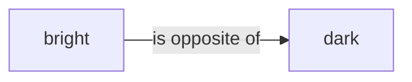
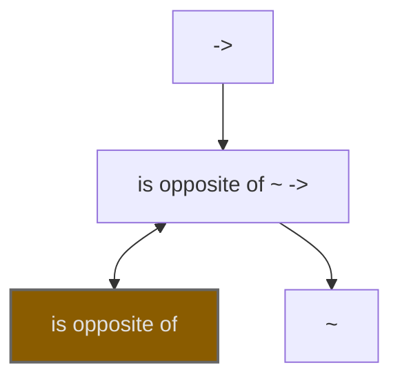
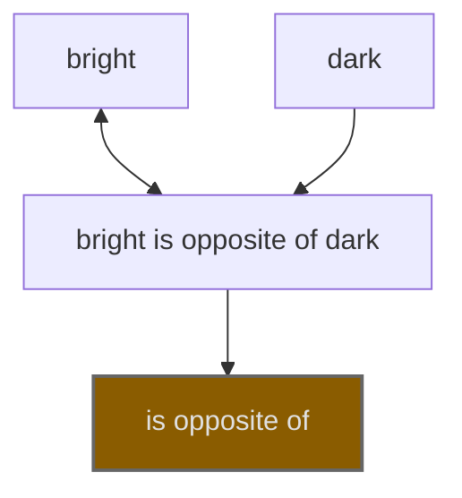

# Rules and Inference

One of zelph's most powerful features is the ability to define inference rules within the same network as facts. Rules are statements containing `=>` with conditions before it and a consequence after it.

For an in-depth treatment of zelph's rule system — including deep unification, negation as failure, inequality constraints, fresh variables, and the formal connection to predicate logic — see [Logic and Computation](logic.md).

## Rule Syntax

A rule in zelph is formally a statement where the subject is a **set of conditions** (marked as a conjunction) and the object is the **consequence**.

Example rule:

```
(*{(R ~ transitive) (X R Y) (Y R Z)} ~ conjunction) => (X R Z)
```

**Breakdown of the syntax:**

1. `{...}`: Creates a **Set** containing three fact templates:
   - `R` is a transitive relation.
   - `X` is related to `Y` via `R`.
   - `Y` is related to `Z` via `R`.
2. `~ conjunction`: Defines that this Set represents a logical "AND" (Conjunction). The inference engine only evaluates sets marked as conjunctions.
3. `(*...)`: The surrounding parentheses create the fact `Set ~ conjunction`.
4. `*`: The **Focus Operator** at the beginning ensures that the expression returns the **Set Node** itself, not the fact node `Set ~ conjunction`.
5. `=>`: The inference operator. It links the condition Set (Subject) to the consequence (Object).
6. `(X R Z)`: The consequence fact.

This rule states: _If there exists a set of facts matching the pattern in the conjunction, then the fact `X R Z` is deduced._

### Syntax Sugar for Conditions

A parenthesised group that contains commas is parsed as **conjunction syntax sugar**:

```
(cond1, cond2, cond3)
```

Each comma-separated condition is itself a normal zelph statement fragment (either a fact pattern like `X R Y`, or a nested expression). The whole parenthesised expression evaluates to a **set node** that is automatically tagged as a conjunction internally (i.e. it desugars to the same topology as `(*{...} ~ conjunction)`).

What matters is what a condition **evaluates to**: it has to be a statement, because a condition is matched against the graph and a node carries nothing to match. A [focus](concepts.md#the-focus-operator) in that position therefore does not do what it looks like — it makes its statement evaluate to the focused node — and is refused:

```
zelph> (*A p C, C q b) => (A marked yes)
Error in line "(*A p C, C q b) => (A marked yes)": condition 1 of the comma list is "A", which is not a statement and can never match. A focus makes its statement evaluate to the focused node, so a condition written "*A p C" is the node A -- write it "A p C" instead.
```

A focus one level down stays useful, since the condition still evaluates to a fact: `((*A p c) q b, A r d)` is the condition `A q b`, with `A p c` created on the side.

Practical consequence: you can write the above example rule as

```
(R ~ transitive, X R Y, Y R Z) => (X R Z)
```

without using the set syntax `{...}` or the `conjunction` core node.

## Examples

Here is a practical example of how a transitive-closure rule works in zelph (which you can also try out in interactive mode):

```
zelph> (R is transitive, A R B, B R C) => (A R C)
((A R B), (R is transitive), (B R C)) => (A R C)
```

After the entered rule, we see zelph's output, which in this case simply confirms the input of the rule.

Now, let's declare that the relation `>` (greater than) is an instance of transitive relations:

```
zelph> > is transitive
>  is   transitive
```

Next, we provide three elements ("4", "5" and "6") for which the `>` relation applies:

```
zelph> 6 > 5
 6  >  5
zelph> 5 > 4
 5  >  4
(6 > 4) ⇐ {(6 > 5) (> is transitive) (5 > 4)}
zelph>
```

After entering `5 > 4`, zelph's unification mechanism takes effect and automatically adds a new fact: `6 > 4`. This demonstrates the power of the transitive relation rule in action. Note that the rule uses `R` as a variable for the predicate itself — this is possible because predicates are first-class nodes in the graph, not edge labels. Any relation that is declared `is transitive` will automatically benefit from this single rule.

Rules can also define contradictions using `!`:

```
zelph> (X "is opposite of" Y, A ~ X, A ~ Y, X != Y) => !
((X "is opposite of" Y), (A ~ X), (X != Y), (A ~ Y)) => !
zelph> bright "is opposite of" dark
bright "is opposite of" dark
zelph> yellow ~ bright
 yellow   ~   bright
zelph> yellow ~ dark
 yellow   ~   dark
! ⇐ {(bright "is opposite of" dark) (yellow ~ bright) (bright != dark) (yellow ~ dark)}
Found one or more contradictions!
zelph>
```

This rule states that if X is opposite of Y and X ≠ Y, then an entity A cannot be both an instance of X and an instance of Y, as this would be a contradiction. The `X != Y` guard is essential here: without it, a reflexive fact like `bright "is opposite of" bright` could cause a spurious contradiction when `yellow ~ bright` is entered, because `X` and `Y` would both bind to `bright` (see [Inequality Constraints](logic.md#inequality-constraints) for a detailed discussion).

A contradiction is **reported, not enforced**. The facts that triggered it stay in the graph – zelph is built to audit inconsistent real-world data, and deleting the evidence would defeat that.

What _is_ written is the contradiction itself: the set of the facts that matched, entered as **refuted** – "these statements do not hold together". Nothing is retracted by it. Every member stays asserted and keeps answering queries, including the conjunctive one; the set is the only node created, and a condition that matched no fact, such as an `!=` guard, contributes nothing to it.

That record is what makes a contradiction reported **once**. A set constant is defined by its members, so the same contradiction always yields the same node, and the next run finds it already present – the same way a derived fact remains silent on the second occurrence because the graph holds it. Two consequences worth knowing: the record ceases when the facts it pertains to are removed, so a contradiction emerges as a new discovery if those facts return; and it is indexed upon those facts rather than upon the rule, so two rules contradicting on the same statements report only once between them.

`.contradiction-records off` turns the record off, and the repetition with it. The cost it trades away is one set node per distinct contradiction, which is six figures on a Wikidata-scale audit.

What you get on top is a report – on the console, and in the [derivation export](#exporting-derivations) as a record with `"kind":"contradiction"` and the premises that produced it. The export is written on every run that meets the contradiction, whether or not the console line was printed, so a second `.run-export` does not return an empty file.

`!` remains the one consequence that derives no fact, which is why a contradiction rule is always safe in the [deferred stratum](logic.md#stratified-evaluation): it can derive nothing that another rule could then negate. The refuted set is a record ABOUT the match, not a derivation from it.

## Internal Representation of facts

In a conventional semantic network, relations between nodes are labeled, e.g.



zelph's representation of relation types works fundamentally differently.
As mentioned in the introduction, one of zelph's distinguishing features is that it treats relation types as first-class nodes rather than as mere edge labels.

Internally, zelph creates special nodes to represent relations.
For example,when identifying "is opposite of" as a relation (predicate), this internal structure is created:



The nodes `->` and `~` are predefined zelph nodes. `->` represents the category of all relations, while `~` represents a subset of this category, namely the category of categorical relations. Every relation that differs from the standard relation `~` (like "is opposite of") is linked to `->` via a `~` relation.

The node `is opposite of ~ ->` represents this specific relation (hence its name).
The relations to other nodes encode its meaning.

This approach provides several advantages:

1. It enables meta-reasoning about relations themselves
2. It simplifies the underlying data structures
3. It allows relations to participate in other relations (higher-order relations)
4. It provides a unified representation mechanism for both facts and rules

This architecture is particularly valuable when working with knowledge bases like Wikidata, where relations (called "properties" in Wikidata terminology) are themselves first-class entities with their own attributes, constraints, and relationships to other entities. zelph's approach naturally aligns with Wikidata's conceptual model, allowing for seamless representation and inference across the entire knowledge graph.

Similarly, when stating:

```
bright "is opposite of" dark
```

zelph creates a special relation node that connects the subject "bright" bidirectionally, the object "dark" in reverse direction, and the relation type "is opposite of" in the forward direction.



The directions of the relations are as follows:

| Element       | Example        | Relation Direction |
| ------------- | -------------- | ------------------ |
| Subject       | white          | bidirectional      |
| Object        | black          | backward           |
| Relation Type | is opposite of | forward            |

This semantics is used by zelph in several contexts, such as rule unification. It's required because zelph doesn't encode relation types as labels on arrows but rather as equal nodes. This has the advantage of facilitating statements about statements, for example, the statement that a relation is transitive.

zelph also supports **self-referential facts**, where subject and object are the same
node (e.g., `A cons A`). These arise rarely in practice — Wikidata contains a small
number of such entries, for example `South Africa (Q258) country (P17) South Africa
(Q258)`. On input and output, such facts are covered by the
[self-fact prefix `:`](concepts.md#the-self-fact-prefix): the Wikidata example prints as
`:P17 Q258`. Internally, the object connection is omitted because the subject is already
connected to the fact-node bidirectionally, which serves as the implicit object
connection. Detection is unambiguous: a fact-node whose left-neighbor set contains
only the subject node (no additional unidirectional incoming connection) is
self-referential.

## Internal representation of rules

Rules are not stored in a separate list; they are an integral part of the semantic network. The implication operator `=>` is treated as a standard relation node.

When you define:
`(*{A B} ~ conjunction) => C`

The following topology is created in the graph:

1. A node `S` is created to represent the set of conditions.
2. The conditions `A` and `B` are linked to `S` via `PartOf` relations.
3. A fact node represents `S ~ conjunction` (defining the logical AND).
4. A fact node represents `S => C` (the rule itself).

When the inference engine scans for rules, it looks for all facts involving the `=>` relation. It examines the subject (the set `S`), verifies that `S` is connected to `conjunction` via `~`, and if so, treats the elements of `S` as the condition patterns.

This means that **a rule is completely represented by standard subject-predicate-object triples**, with `=>` serving as a standard predicate.

## Facts and Rules in One Network: Unique Identification via Topological Semantics

A distinctive aspect of **zelph** is that **facts and rules live in the same semantic network**. That raises a natural question: how does the unification engine avoid confusing ordinary entities with statement nodes, and how does it keep rule matching unambiguous?

The answer lies in the network's **strict topological semantics** (see [Internal Representation of facts](#internal-representation-of-facts) and [Internal representation of rules](#internal-representation-of-rules)). In zelph, a _statement node_ is not "just a node with a long label"; it has a **unique structural signature**:

- **Bidirectional** connection to its **subject**
- **Forward** connection to its **relation type** (a first-class node)
- **Backward** connection to its **object**

The unification engine is **hard-wired to search only for this pattern** when matching a rule's conditions. In other words, a variable that ranges over "statements" can only unify with nodes that expose exactly this subject/rel/type/object wiring. Conversely, variables intended to stand for ordinary entities cannot accidentally match a statement node, because ordinary entities **lack** that tri-partite signature.

Two immediate consequences follow:

1. **Unambiguous matching.** The matcher cannot mistake an entity for a statement or vice versa; they occupy disjoint topological roles.
2. **Network stability.** Because statementhood is encoded structurally, rules cannot "drift" into unintended parts of the graph. This design prevents spurious matches and the sort of runaway growth that would result if arbitrary nodes could pose as statements.

## Performing Inference

By default, zelph triggers the inference engine immediately after every fact or rule is entered. You can toggle this behaviour using the `.auto-run` command.

**Performance Note:** When working with large datasets, continuous inference can be computationally expensive. Therefore, the `.load` command automatically **disables** auto-run mode to ensure efficient data loading. You can re-enable it manually at any time by typing `.auto-run`.

Queries containing variables (e.g., `A "is capital of" Germany`) are always evaluated immediately, regardless of the auto-run setting.

If auto-run is disabled, you can trigger inference manually:

```
.run
```

This performs full inference: rules are applied repeatedly until no new facts can be derived. New deductions are printed as they are found.

For a single inference pass:

```
.run-once
```

To record everything a run derived, for further processing:

```
.run-export <file>
```

See [Exporting Derivations](#exporting-derivations). For normal interactive
or script use, `.run` is the standard command.

### Deduction Output Modes

zelph performs forward chaining: every derivable consequence is materialized
in the graph (see [Logic and Computation](logic.md#positioning-forward-chaining-over-graphs)).
For rule libraries that implement computations — the arithmetic modules are
the prime example — this is a double-edged sword: a single input like
`&10 - &3` triggers a long cascade of internal derivations (recursion
states, canonicalization steps) that are essential to the computation but
rarely interesting to read. In a goal-driven system like Prolog this
question does not arise, because only the proof of the asked goal is ever
constructed; in a forward chainer, filtering the _trace_ is the natural
counterpart.

The `.deductions` command controls which derived facts are printed:

    .deductions all      # print every deduction (full derivation trace)
    .deductions focus    # print only deductions about your input (default)
    .deductions off      # print no deductions

In `focus` mode, a deduction is printed when its subject stems from an
interactively entered statement: the subject is the entered fact itself, or
its subject, or one of its objects. Anchors accumulate over the session, so
a rule entered later still surfaces conclusions about earlier inputs.
Imported scripts (`.import`) do not contribute anchors — a loaded arithmetic
library stays silent about its internals.

**What is printed is deterministic; the order in which it appears is not.**
The reasoner is parallel (`.parallel`), so two runs of the same input derive
the same facts and answer the same queries, but the deduction lines, the
answers of one query, and the bindings of two variables that could be
exchanged may come out in a different order – and a `(skipped N deductions)`
line may fall in a different place. Transcripts in this documentation are real
runs; read them as one of the possible orders.

The filter affects printing only: **all facts are derived and stored
regardless of the mode**, and query answers, contradictions and warnings are
always printed. If a result you are interested in is not shown, query it
(e.g. `&7 > X`) or switch to `.deductions all`. Filtered deductions are
counted in the "(skipped N deductions)" summary. As a side effect, heavy
computations run several times faster in focus/off mode, because rendering
large derived terms dominates the cost.

## Exporting Derivations

`.run-export <file>` performs full inference like `.run` and writes what THAT
run derives, plus every contradiction it meets, to `<file>` — one JSON object
per line (JSON Lines):

```json
{"kind":"deduction","conclusion":[SEG,...],"premises":[[SEG,...],...]}
```

A `SEG` is either a JSON string — literal text of the rendering, brackets
and spacing — or one of

```json
{"names":{"wikidata":"Q5","en":"human"}}
{"core":"!"}
```

the first naming one node in every language it is known by, the second one
of zelph's own vocabulary (`!`, `~`, `=>`, …).

Two properties are worth spelling out, because they are the point of the
format:

- **Nothing in it is about a target format.** Which of a node's names to
  display, which of them is a URL, whether identifiers should be
  italicised, which file a line belongs in — those are decisions of the
  consumer. zelph does not know about Wikidata, and it does not know about
  MkDocs either.
- **The premises are separate.** The console prints the condition _set_,
  `⇐ {(a p b) (b p c)}`, because that set is what the rule's subject is.
  The export hands over its elements, so no one has to take braces apart
  again.

Two more, which decide how the file may be counted:

- **A derivation the graph already holds is not re-derived, so it is not
  written.** Deductions are hash-consed: a fact that exists produces no
  deduction to export. Over a saturated network — one that a `.run` has
  already completed — the deduction side of the file is therefore EMPTY, and
  the command still exits as if it had worked. Export from the run that does
  the deriving, or start from `.new`. The same property means only the FIRST
  derivation of a fact is ever written: a second rule reaching the same
  conclusion adds no record, so the file holds one justification per fact and
  not all of them — the same limit `.help .explain` states for the proof tree.
- **Contradictions are the deliberate exception, and they repeat.** A
  contradiction is written every time a run meets it, so that a second
  `.run-export` does not hand back an empty file — which means the same
  violation can occupy several lines. Counting violations therefore means
  deduplicating on the premise set, order-independently, not counting lines.

A contradiction record carries one more field when the engine **refused** to
build the deduced fact — a shape it cannot represent — rather than finding the
knowledge base contradictory. Both stop the rule, and both are reported as
`!`, so the reason is what tells them apart:

```json
{"kind":"contradiction",
 "conclusion":[{"core":"!"}],
 "refused":"a set constant cannot be extended -- {a b} IS its members. Write the collection literal @{...} for a container that membership can grow.",
 "premises":[["(",{"names":{"zelph":"q"}}," ",{"names":{"zelph":"p"}}," ",{"names":{"zelph":"r"}},")"]]}
```

The field is absent on a contradiction of the data, so counting those means
counting the records that do **not** have it.

Deduction printing is off during the run: rendering large derived terms
dominates the wall-clock time, and the file is the point.

```
zelph> .lang wikidata
wikidata> .auto-run
Auto-run is now disabled.
wikidata-> Q1 P279 Q2
 Q1   P279   Q2
wikidata-> Q2 P279 Q3
 Q2   P279   Q3
wikidata-> (*{(A P279 B) (B P279 C)} ~ conjunction) => (A P279 C)
((B P279 C), (A P279 B)) => (A P279 C)
wikidata-> .run-export /tmp/derivations.jsonl
Running full inference; derivations are written to /tmp/derivations.jsonl as JSON Lines.
```

Content of `/tmp/derivations.jsonl` (one line, wrapped here for reading):

```json
{"kind":"deduction",
 "conclusion":["(",{"names":{"wikidata":"Q1"}}," ",{"names":{"wikidata":"P279"}}," ",{"names":{"wikidata":"Q3"}},")"],
 "premises":[["(",{"names":{"wikidata":"Q2"}}," ",{"names":{"wikidata":"P279"}}," ",{"names":{"wikidata":"Q3"}},")"],
             ["(",{"names":{"wikidata":"Q1"}}," ",{"names":{"wikidata":"P279"}}," ",{"names":{"wikidata":"Q2"}},")"]]}
```

### Converting the export

`dev_scripts/zelph-derivations.py` is the reference converter, and the two
formats it writes are what the reports on zelph.org are built from:

```bash
# The MkDocs tree behind the reports on https://zelph.org: one page per
# Wikidata identifier occurring in a conclusion, with links between pages.
dev_scripts/zelph-derivations.py /tmp/derivations.jsonl --format md --out mkdocs/docs/report

# One flat line per derivation, premises first.
dev_scripts/zelph-derivations.py /tmp/derivations.jsonl --format text --out /tmp/derivations.txt
```

```
Q2 P279 Q3, Q1 P279 Q2 => Q1 P279 Q3
```

The `text` form is also the starting point for tokenizer-friendly training
data. Long numeric identifiers (`Q123456789`) are expensive for standard
tokenizers, which split them into many sub-tokens; because every identifier
arrives in the export as a discrete token rather than as a substring of a
sentence, substituting a compact encoding for it is a dictionary lookup and
not a parse. zelph ships no such encoding: which one fits is exactly the kind
of decision that belongs to the consumer of the data.

## Node Clusters: Transactional Workspaces

When experimenting on a large loaded network — say, a full Wikidata dump — you often want to undo an entire experiment without reloading everything. Clusters provide exactly that:

```
.cluster my-experiment
... enter facts and rules, .run ...
.cluster-drop my-experiment      # roll back everything the experiment created
```

While a cluster is active, every node created is recorded in it: entities, relation nodes, rule definitions, the variables those rules are made of, and facts deduced by `.run`. Facts that already existed beforehand are never recorded, so dropping a cluster can never destroy pre-existing knowledge — a fact from before the cluster cannot name a node the cluster created. One change to a pre-existing node is undone all the same: claiming a statement that was only a rule's ground pattern revokes that marking, and the drop restores it, so an experiment cannot turn a rule's patterns into data for good. The line is that a marking is the engine's own bookkeeping about a node rather than a claim anybody made; names and merges stay outside it. What a drop does take, beyond its own nodes, is anything BUILT on one of them afterwards: a fact entered outside the cluster that names a cluster node goes with it, and so does a rule such a fact is a condition of. A fact that had merely lost a part would not be recognisable as incomplete (`.help .remove` explains why), so the reported count is what actually went, which can exceed what the cluster recorded. `.cluster-merge <from> <to>` commits a cluster's bookkeeping into another one (merging into `default` simply turns its nodes into ordinary nodes), and `.cluster default` deactivates tracking. Clusters are session state and are not persisted by `.save`.

The [neural network demo](neural.md) uses a cluster so that the entire experiment — layers, synapses, rules, and all deductions — can be removed with a single command, leaving the loaded dump untouched.

A second use is taking a demonstration back out of the graph whole – the
facts, the rule and the record together. A contradiction provoked on purpose
is announced once (see
[Contradiction Detection](logic.md#contradiction-detection)), and dropping the
cluster removes what caused it:

```
.cluster demo
:isprime &9                      # provokes the contradiction, once
.cluster-drop demo               # ... and takes it back out again
```

(`.prune-facts` on the offending fact does the same job when a cluster is
too coarse. Either way the record goes with the facts it is about, so the
same contradiction is a fresh finding if they ever return.)
